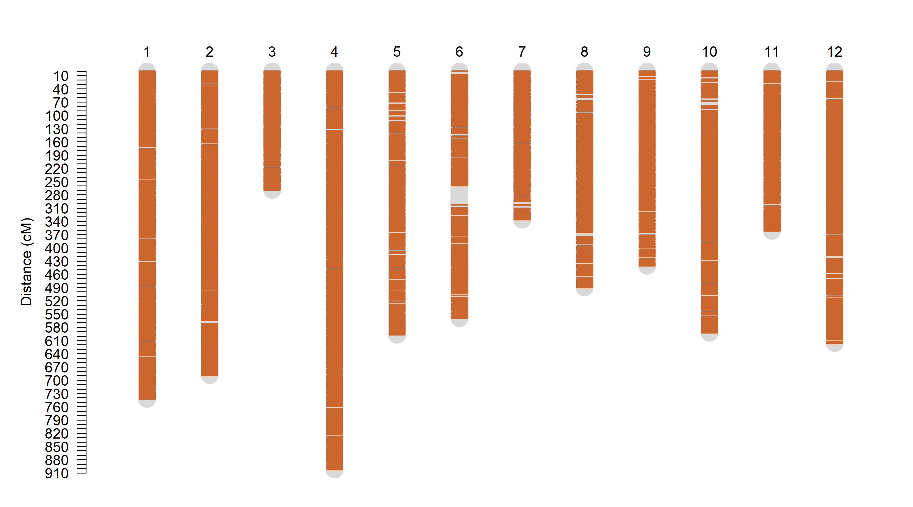
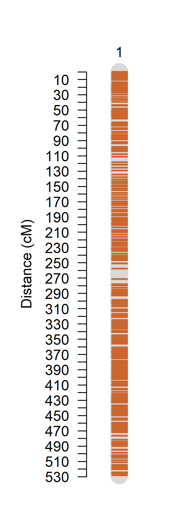
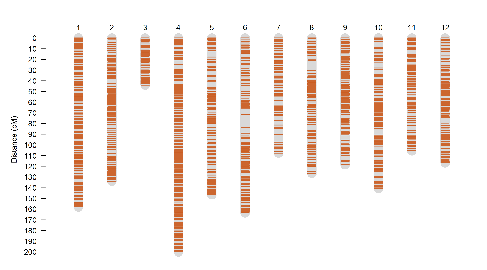

This tutorial will show how to build a linkage map for inbred lines populations with only the most updated methods implemented in OneMap. The complete tutorial, containing examples of all OneMap functions for inbred lines is available [here]().

# Install OneMap

From GitHub (version: 3.1.0):

```{r, eval=FALSE}
devtools::install_github("Cristianetaniguti/onemap")
```

# Input File

Here, we will work with a tomato genotyping-by-sequencing dataset with 148 RILs and two parental lines. See further details about the dataset in the NCBI experiment [SRR7060267](https://www.ncbi.nlm.nih.gov/sra/SRX3991168[accn]). We previously used [Reads2Map](https://github.com/Cristianetaniguti/Reads2Map) workflow to perform the alignment of the sequences with the tomato SL4.0 reference genome using [BWA](https://bio-bwa.sourceforge.net/bwa.shtml) and the SNP calling with [STACKs](https://catchenlab.life.illinois.edu/stacks/).

* You can download the resulted VCF file from [here](https://drive.google.com/drive/folders/1jk5rq4Bn_xo_S7vCbtqGfNDkvHw6_7ln?usp=drive_link).

It is common that GBS datasets provides a large amount of markers, you may want to filter some of them before starting the analysis in R to optmize time and computational resources. For filtering the VCF file, we suggest a simple and efficient tool called [vcftools](https://vcftools.sourceforge.net/). 

If using a Linux based operational system or WSL in Windows you can install vcftools using:

```{bash, eval=FALSE}
sudo apt-get install vcftools
```

See other installation options [here](https://vcftools.github.io/downloads.html) and the [vcftools manual](https://vcftools.sourceforge.net/man_latest.html) for further information.

We filtered our VCF file by maximum percentage of missing data of 30% for a marker across all samples and a Minor Allele Frequency (MAF) of 5%. 

```{bash, eval=FALSE}
vcftools --gzvcf tomato_stacks_markers.vcf.gz --maf 0.05 --max-missing 0.3 --out tomato_stacks_filtered --recode
```

The resulted VCF file has 22.257 markers. 

We can convert the VCF file to an onemap object using the function `onemap_read_vcfR`:

```{r}
library(onemap)

onemap.obj <- onemap_read_vcfR(vcf = "tomato_stacks_filtered.recode.vcf.gz", 
                               cross = "ri self",
                               parent1 = "NCEBR", 
                               parent2 = "LA2093")

```

The function also filter markers that are considered non-informative for mapping purposes.

OneMap has other options for input file format, check the session [`Creating the data file`](https://statgen-esalq.github.io/tutorials/onemap/Inbred_Based_Populations.html#creating-the-data-file) in the complete tutorial.

Visualize the markers:

```{r}
plot(onemap.obj)
```

# Filters

* Missing data

While converting the VCF file the function also replace by missing data genotypes in the progeny that are not expected by the marker segregation. Therefore, we will need to filter by missing data again:

```{r}
onemap.obj.mis <- filter_missing(onemap.obj, threshold = 0.3)
plot(onemap.obj.mis)
```

By the graphic you can see that there are individuals with more missing data than others. We can also filter out by individuals:

```{r}
onemap.obj.mis.ind <- filter_missing(onemap.obj.mis, threshold = 0.35, by = "individuals")
plot(onemap.obj.mis.ind)
onemap.obj.mis.ind
```

* Redundant markers

We can also keep only one of the markers that has same genotypes cross all individuals:

```{r}
bins <- find_bins(onemap.obj.mis.ind, exact = FALSE)
onemap.bins <- create_data_bins(onemap.obj.mis.ind, bins)
onemap.bins
```

* Segregation distortion

```{r}
segr.test <- test_segregation(onemap.bins)
plot(segr.test)
segr.idx <- select_segreg(segr.test, distorted = FALSE, numbers = TRUE)
```

# Estimate recombination fraction

```{r}
twopts <- rf_2pts(onemap.bins)
```

# Group and ordering

For this dataset we have the information of each marker chromosome location according to the reference genome used in the SNP calling analysis. However, OneMap also present functions that can be used to group and order in case there is no such information available. See further details in the complete tutorial session [`using only recombination information`](https://statgen-esalq.github.io/tutorials/onemap/Inbred_Based_Populations.html#using-only-recombinations-information).

```{r}
# Create sequences objects for each chromosome
table(twopts$data.name$CHROM)
chrom.names <- unique(twopts$data.name$CHROM)

seqs <- heatmaps <- list()
for(i in 1:length(chrom.names)){
  print(paste("Evaluating", chrom.names[i]))
  # Get sequence of markers based on their chromosome location
  temp_seq <- make_seq(twopts, chrom.names[i])
  # Remove distorted and order by genome location
  seq_num <- temp_seq$seq.num[which(temp_seq$seq.num %in% segr.idx)]
  seqs[[i]] <- ord_by_geno(make_seq(twopts, seq_num))
  heatmaps[[i]] <- rf_graph_table(seqs[[i]], inter = FALSE, mrk.axis = "none")
}

names(seqs) <- chrom.names

```

Check the ordering by the recombination fraction heatmaps:

```{r}
library(ggpubr)
p_genomic <- ggarrange(plotlist = heatmaps, common.legend = TRUE)
p_genomic
```

```{r}
# Order using UG - other possible algorithms: mds_onemap, rcd, record, seriation, order_seq
seq7_ug <- ug(seqs[[7]], hmm = FALSE)  
# Build recombination fraction matrix heatmap graphic
heatmap7_ug <- rf_graph_table(seq7_ug, inter = FALSE, mrk.axis = "none")

heatmap7_ug
heatmaps[[7]]
```

```{r, eval=FALSE}
# Fix genomic ordering
edit_seq7 <- edit_order_onemap(input.seq = seq7_ug)
new_seq7 <- make_seq(edit_seq7)
heatmap7_edit <- rf_graph_table(new_seq7, inter = FALSE, mrk.axis = "none")
heatmap7_edit

seqs[[7]] <- new_seq7
```

```{r, echo=FALSE}
new_seq7 <- make_seq(twopts,c(1232,1220,1219,1208,1218,1217,1216,1164,1215,1211,1201,1214,1177,1213,1169,1210,1198,1205,1185,1197,1196,1195,1193, 1191,1183,1158,1189,1187,1168,1156,1184,1182,1181,1179,1178,1176,1175,1155,1171,1170,1167,1163,1162,1157,1153,1150,1149,1148,1146,1145,1144,1143,1140,1139,1138,1137,1134,1131,1130,1129,1128,1127,1126,1125,1124,1123,1122,1121,1120,1119,1118,1117,1116,1115,1114,1113,1112,1111,1110,1109,1108,1107,1106,1105,1104,1103,1102,1101,1100,1099,1098,1097,1096,1095,1094,1092,1093,1091,1090,1089,1088,1087,1086,1085,1084,1083,1082,1081,1080,1079,1075,1078,1077,1076,1074,1073,1072,1071,1070,1271,1276,1277,1278,1281,1282,1280,1283,1284,1285,1287,1286,1288,1289,1290,1291,1292,1293,1294,1295,1296,1298,1299,1300,1301,1302,1303,1304,1305,1306,1308,1307,1309,1310,1311,1313,1312,1314,1315,1316,1317,1318,1319,1320,1321,1322,1323,1324,1325,1326,1327,1329,1330,1331,1328,1332,1334,1335,1336,1333,1337,1338,1339,1340,1341,1342,1343,1345,1346,1344,1348,1349,1347,1350,1351,1352,1354,1353,1355,1356,1357,1358,1359,1360,1362,1361,1363,1364,1365,1366,1368,1369,1367,1370,1371,1372,1373,1374,1375,1376,1377,1378,1379,1380,1381,1382,1383,1384,1385,1387,1388,1389,1386,1391,1392,1393,1390,1394,1395,1396,1397,1398,1399,1400,1401,1402,1403,1404,1405,1407,1406,1408,1409,1410,1411,1412,1413,1414,1415,1416,1417,1418,1419))

heatmap7_edit <- rf_graph_table(new_seq7, inter = FALSE, mrk.axis = "none")
heatmap7_edit

seqs[[7]] <- new_seq7
```

# Estimate multipoint genetic distances

Once the ordering is done, we can estimate the genetic distances using the Hidden Markov Model multipoint approach. This can take some time depending on the number of markers. We can use parLapply to parallelize the process:

```{r}
library(parallel)
n.cores <-2 
clust <- makeCluster(n.cores)
maps <- parLapply(clust, seqs[-1], map)
stopCluster(clust)

```

Overview of the relation between genomic and linkage map distances:

```{r}
mbXcm <- plot_genome_vs_cm(maps)
mbXcm
```

# Add markers from non-assembled sequences

Try to add the markers from chromosome 0 to the other groups:

```{r}
lgs_group <- group_seq(twopts, seqs = seqs[-1], unlink.mks = seqs[[1]], repeated = FALSE)
str(lgs_group, max.level = 1)
str(lgs_group$input.seqs, max.level = 1)
str(lgs_group$out.seqs, max.level = 1) # three markers grouped in the chromosome 2

# Identify best ordering for the inserted markers:
insert <- seqs[[1]]$seq.num[seqs[[1]]$seq.num %in% lgs_group$out.seqs$SL4.0ch02]

chr02 <- try_seq_by_seq(sequence = maps[[1]], markers = insert, cM.thr = 40, lod.thr = -100)
p_chr02 <- rf_graph_table(chr02, mrk.axis = "none")
insert
p_chr02
```

```{r}
maps[[1]] <- chr02
```

```{r}
draw_map2(maps, output = "maps.png")
```



```{r}
chr03 <- ord_by_geno(maps[[6]])
chr03 <- map(chr03)

draw_map2(chr03, output = "chr03.png")
```



```{r}
maps[[6]] <- chr03
```

# Adjusting global error

See further information about the usage of global error in the HMM in the [Reads2Map](https://www.biorxiv.org/content/10.1101/2022.11.24.517847v3) manuscript.

```{r}
clust <- makeCluster(n.cores)
maps_error <- parLapply(clust, maps, function(x) onemap::map(x, global_error = 0.05))
stopCluster(clust)

draw_map2(maps_error, output = "maps_error.png")
```



# Visualize haplotypes

```{r}
haplo <- progeny_haplotypes(maps_error, group_names = chrom.names[-1], ind = 1)
plot(haplo)
```

# Add redundant markers

```{r}
maps_done <- list()
for(i in 1:length(maps_error)){
  maps_done[[i]] <- add_redundants(maps_error[[i]], onemap.obj.mis.ind, bins)
}

mbXcm <- plot_genome_vs_cm(maps_done)
mbXcm
```

# Export output

```{r}
# Export linkage map distances:
write_map(maps_done, file.out = "maps.out")
```

