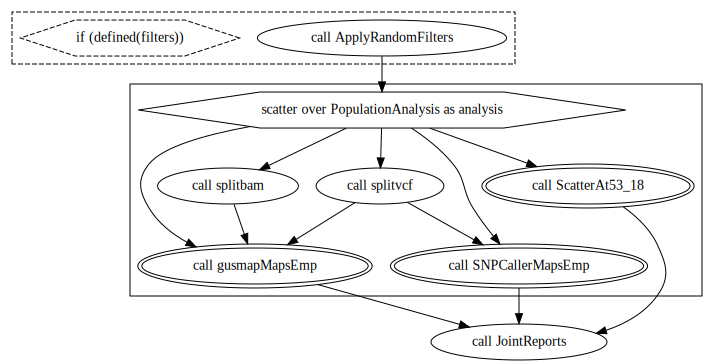

## EmpiricalSNPCalling

### Overview

The `EmpiricalSNPCalling` workflow performs the alignment of FASTQ to a reference genome, SNP calling with `GATK` tools (`HaplotypeCaller`, `GenomicsDBImport`, and `GenotypeGVCFs`) and `Freebayes`. The samples are split into chunks to be run in different nodes and optimize the analyses. Set the number of samples by chunk in the `chunk_size` input. Use `max_cores` to define the number of cores to be used in each node.

The workflow also includes de options to:

* Remove of not the read duplicates
* Perform the Hard Filtering in `GATK` results
* Replace the VCF AD format field with counts from BAM files
* Run `MCHap` software to build haplotypes based on `GATK` called markers

This workflow requires:

* Diploid or polyploid specie
* Single-end reads

<center>

**Workflow**


</center>

<br/><br/>

<center>

**Subworkflows**


<br/><br/>


<br/><br/>


<br/><br/>
</center>

### Input files

The `EmpiricalSNPcalling` requires demultiplexed and cleaned FASTQ files. We made available a suggestion for preprocessing reads in `PreprocessingReads.wdl`.

First, go to our [releases page](https://github.com/Cristianetaniguti/Reads2Map/releases) and download the assets of the most recent version of the `EmpiricalSNPCalling` workflow. 

You will need the following input information:

**samples_info**: tsv file with the first column with the path to FASTQ files, a second column with sample names, and the third column with sample names and lane specifications. Example:

```
tests/data/Ptremula_PRJNA395596_subset/fastq/SRR6249787.sub.fastq   I_3_55  I_3_55.Lib1_C09_AGAAGTC
tests/data/Ptremula_PRJNA395596_subset/fastq/SRR6249788.sub.fastq   I_3_66  I_3_66.Lib1_D06_GCCAACT
tests/data/Ptremula_PRJNA395596_subset/fastq/SRR6249795.sub.fastq   PT_F    PT_F.Lib1_E09_TGAACAT
tests/data/Ptremula_PRJNA395596_subset/fastq/SRR6249808.sub.fastq   PT_M    PT_M.Lib2_E06_CGATGCG
```

**ploidy**: specie ploidy

**n_chrom**: specie number of chromosomes (this is used to parallelize `freebayes` in nodes)

**chunk_size**: how many samples are to be evaluated by `GATK` in a single same node

**max_cores**: maximum number of cores to be used by alignment and `freebayes` tasks

**empirical.references**

- ref_fasta: chromosome sequence in fasta format (only one chromosome at a time)

- ref_fasta_index: index made by samtools faidx

- ref_dict: index made by picard dict

- ref_sa: index made by bwa index

- ref_amb: index made by bwa index

- ref_bwt: index made by bwa index

- ref_ann: index made by bwa index

- ref_pac: index made by bwa index

You can use the following containers to create these indexes. Example:

```
docker run -v $(pwd):/data/ us.gcr.io/broad-gotc-prod/genomes-in-the-cloud:2.5.7-2021-06-09_16-47-48Z samtools faidx tests/data/PtrichocarpaV3.0/Chr10.11.2M.fa
docker run -v $(pwd):/data/ us.gcr.io/broad-gotc-prod/genomes-in-the-cloud:2.5.7-2021-06-09_16-47-48Z /usr/gitc/./bwa index tests/data/PtrichocarpaV3.0/Chr10.11.2M.fa
docker run -v $(pwd):/data/ us.gcr.io/broad-gotc-prod/genomes-in-the-cloud:2.5.7-2021-06-09_16-47-48Z java -jar /usr/gitc/picard.jar CreateSequenceDictionary R=tests/data/PtrichocarpaV3.0/Chr10.11.2M.fa O=tests/data/PtrichocarpaV3.0/Chr10.11.2M.dict
```

**rm_dupli**: if workflow should (true) or not (false) remove the duplicated sequences from the alignment file before the SNP calling analysis

**replaceAD**: if allele depth (AD) in VCFs generated by `GATK` and `freebayes` should be replaced by allele depth from alignment files (BAM)

**run_gatk**: true for running `GATK`

**hardfilters**: true for performing Hard filtering in `GATK` results (see more about it [here](https://gatk.broadinstitute.org/hc/en-us/articles/360035890471-Hard-filtering-germline-short-variants))

**gatk_mchap**: true for running `MCHap` in `GATK` results

**run_freebayes**: true for running `freebayes`

The files outputted by `EmpiricalSNPCalling.wdl` are inputs for `EmpiricalMaps.wdl`. However, we suggest checking the VCF markers' quality parameters to apply proper filters before proceeding to `EmpiricalMaps.wdl`. The `EmpiricalMaps.wdl` is limited to running only one chromosome, make sure you filter the VCF to retain only the selected one.

## EmpiricalMaps

### Overview

The `EmpiricalMaps` workflow receives as input VCF files from `EmpiricalSNPCalling` workflow and results in 34 linkage maps for a single chromosome running the combinations:

* SNP calling: `GATK` and `Freebayes`
* Dosage/genotype calling: `updog`, `polyRAD` and `SuperMASSA`
* Linkage map build software: `OneMap` 3.0 and `GUSMap`
* Using genotype probabilities from `GATK`, `Freebayes`, `updog`, `polyRAD` and `SuperMASSA`, and a global error rate of 5% and 0.001% in the `OneMap` HMM.

It also has the options to:

* Include or not multiallelic (MNP) markers
* Apply filters using `VCFtools`

This workflow uses:

* Diploid bi-parental F1 population
* Genomic positions for markers order

<center>

**Workflow**



<br/><br/>

**Subworkflows**


<br/><br/>


<br/><br/>


<br/><br/>

</center>

### Input files

**freebayes_vcf**: vcf file containing markers from `freebayes` SNP calling

**gatk_vcf**: vcf file containing markers from `GATK` SNP calling

**freebayes_vcf_bam_counts**: vcf file containing markers from `freebayes` SNP calling with AD field replaced by BAM files read counts

**gatk_vcf_bam_counts**: vcf file containing markers from `GATK` SNP calling with AD field replaced by BAM files read counts

**dataset**
- parent1: parent 1 ID
- parent2: parent 2 ID
- name: experiment ID
- chromosome: chromosome being evaluated (only one allowed)
- cross: cross type (by now, only F1 is available)
- multiallelics: consider or not the multiallelic markers

**max_cores**: maximum number of CPUs to be used in parallelized process

**gatk_mchap**: true if `MCHap` was used in `GATK` results

**gatk_vcf_multi**: vcf file resulted from `MCHap`

**filters**: specify filters to be applied by `VCFtools`

## Example of how to run

Once you have all the input files, there are some options to run the workflow. See more about it on the [openwdl page](https://github.com/openwdl/wdl). 

One example is using the [`cromwell`](https://cromwell.readthedocs.io/en/stable/) engine. `Cromwell` offers different backend configurations that allow running the workflows in different management systems such as `SLURM` and `SGE`. It is also possible to set configurations to use singularity containers and `MySQL` database to keep a cache of runs. Check some of this configurations options in our [configurations files](https://github.com/Cristianetaniguti/Reads2Map/tree/main/.configurations). You can see further information about all options available in [its documentation](https://cromwell.readthedocs.io/en/stable/). To run the workflow through `cromwell`, you will need first an input file. Use the [womtool](https://github.com/broadinstitute/cromwell/releases) to generate the inputs template:

```{bash, eval=FALSE}
java -jar womtool.jar inputs EmpiricalSNPCalling_v1.0.0.wdl > EmpiricalSNPCalling.inputs.json
```

Adapt the input files paths and run cromwell:

```
Execute the workflow
java -jar /path/to/cromwell.jar run -p EmpiricalSNPCalling_v1.0.0.zip -i EmpiricalSNPCalling.inputs.json EmpiricalSNPCalling_v1.0.0.wdl
```

**Warning**: This analysis demand high computer capacity to run. Check some examples of configurations in `.configurations` directory. Here are two examples of how to use them:

* For storing the metadata and cache in a `MySQL` database (see also [cromwell-cli](https://github.com/lmtani/cromwell-cli) for easy access to metadata):

```
# Open mySQL cointainer
docker run -d -v banco_cromwell:/var/lib/mysql --rm --name mysql-cromwell -p 3307:3306 -e MYSQL_ROOT_PASSWORD=1234 -e MYSQL_DATABASE=cromwell mysql:5.7

# Execute the workflow
java -jar -Dconfig.file=.configurations/cromwell_mysql.conf -jar cromwell.jar run -p EmpiricalSNPCalling_v1.0.0.zip -i EmpiricalSNPCalling.inputs.json EmpiricalSNPCalling_v1.0.0.wdl

# Or execute the workflow through the server interface
java -jar -Dconfig.file=.configurations/cromwell_mysql.conf -jar cromwell.jar server
```

In case you use the server interface, you must open it in your browser in the pointed local address and submit the input (`.json`), workflow (`.wdl`), and the directories struct and tasks compressed (`.zip`).

* If you are using a High-Performance Computing (HPC) with slurm management system:

BATCH file named `slurm_main.sh`:

```
#!/bin/bash

#SBATCH --export=NONE
#SBATCH -J cromwell_Reads2Map
#SBATCH --nodes=1                    
#SBATCH --mem=1G
#SBATCH --time=01:30:00
#SBATCH -o /home/user/Reads2Map.log
#SBATCH -e /home/user/Reads2Map.err

# Maybe it will be required to import java and singularity modules here. Check the specifications of the HPC.
#module load singularity
#module load java

java -jar -Dconfig.file=/home/user/Reads2Map/.configurations/cromwell_no_mysql.conf \
     -jar /home/user/Reads2Map/cromwell-65.jar \
     run /home/user/Reads2Map/EmpiricalSNPCalling_v1.0.0.wdl \
     -p EmpiricalSNPCalling_v1.0.0.zip \
     -i /home/user/Reads2Map/inputs/EmpiricalSNPCalling.inputs.json 
```

When the run is ended, the log description printed on the screen will point to the path for the workflow output files. 

## Generating the workflows graphs

The figures of this tutorial were generated using `womtool` and `graphviz`. Example:

```{bash, eval=FALSE}
java -jar womtool-84.jar graph EmpiricalSNPCalling.wdl > EmpiricalSNPCalling.gv   
dot -Tsvg EmpiricalSNPCalling.gv > EmpiricalSNPCalling.svg
```

## Visualize `Reads2Map` workflows output in `Reads2MapApp`

You can search for all workflow's intermediary files in the `cromwell-executions` directory generated by the Cromwell. The `log` file will specify the workflow id and path for each executed task. The final output of `EmpiricalMaps.wdl` and `SimulatedReads.wdl` are compressed files called `EmpiricalReads_results.tar.gz` and `SimulatedReads_results.tar.gz`. These files contain tables for an overview of the entire procedure. They are inputs for the `Reads2MapApp`, a shiny app that provides a graphical view of the results. Check the [Reads2MapApp repository](https://github.com/Cristianetaniguti/Reads2MapApp) for further information.

