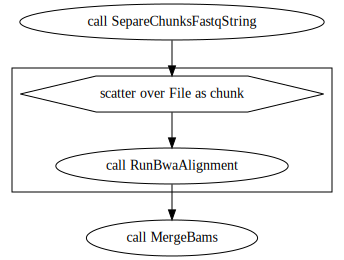

The `EmpiricalSNPcalling` requires demultiplexed and cleaned FASTQ files. We made available a suggestion for preprocessing reads in `PreprocessingReads.wdl`.

* Adapt the path of the inputs in `inputs/EmpiricalSNPCalling.inputs.json`

**samples_info**: tsv file with the first column with the path to FASTQ files, a second column with sample names, and the third column with sample names and lane specifications. Example:

```
data/populus_sub/SRR6249785.sub.fastq   I_3_58  I_3_58.Lib1_C11_TTCCACG
data/populus_sub/SRR6249786.sub.fastq   I_3_56  I_3_56.Lib1_C10_CCTGCAC
data/populus_sub/SRR6249787.sub.fastq   I_3_55  I_3_55.Lib1_C09_AGAAGTC
data/populus_sub/SRR6249788.sub.fastq   I_3_66  I_3_66.Lib1_D06_GCCAACT
data/populus_sub/SRR6249795.sub.fastq   PT_F    PT_F.Lib1_E09_TGAACAT
data/populus_sub/SRR6249808.sub.fastq   PT_M    PT_M.Lib2_E06_CGATGCG
```

**rm_dupli**: if workflow should (TRUE) or not (FALSE) remove the duplicated sequences from the alignment file before the SNP calling analysis;

**chunk_size**: how many samples to be evaluated by GATK in a single same node;

**max_cores**: maximum number of cores to be used by alignment and Freebayes tasks;

**empirical.references**
- ref_fasta: chromosome sequence in fasta format (only one chromosome at a time);
- ref_fasta_index: index made by samtools faidx;
- ref_dict: index made by picard dict;
- ref_sa: index made by bwa index;
- ref_amb: index made by bwa index;
- ref_bwt: index made by bwa index;
- ref_ann: index made by bwa index;
- ref_pac: index made by bwa index.

### Run EmpiricalSNPCalling workflow with the test data set

In the `Reads2Map/data` directory you can find files to run examples. The `toy_genome` presents two FASTA files one with a sub set of 2 million base pares of chromosome 10 and other with the same subset for chromosome 10 and 11. For the empirical data we will use the second: `Chr10.11.2M.fa`. We must provide also the index files generated by BWA, samtools and picard. You can use the follow containers to create these indexes:

```
docker run -v $(pwd):/data/ us.gcr.io/broad-gotc-prod/genomes-in-the-cloud:2.5.7-2021-06-09_16-47-48Z samtools faidx /data/toy_genome/Chr10.11.2M.fa
docker run -v $(pwd):/data/ us.gcr.io/broad-gotc-prod/genomes-in-the-cloud:2.5.7-2021-06-09_16-47-48Z /usr/gitc/./bwa index /data/toy_genome/Chr10.11/2M.fa
docker run -v $(pwd):/data/ us.gcr.io/broad-gotc-prod/genomes-in-the-cloud:2.5.7-2021-06-09_16-47-48Z java -jar /usr/gitc/picard.jar CreateSequenceDictionary R=/data/toy_genome/Chr10.11.2M.fa O=/data/toy_genome/Chr10.11.2M.dict
```

or with singularity:

```
singularity run --bind $(pwd):/data/ us.gcr.io_broad-gotc-prod_genomes-in-the-cloud_2.5.7-2021-06-09_16-47-48Z.sif samtools faidx /data/Chr10.11.2M.fa
singularity run --bind $(pwd):/data/ us.gcr.io_broad-gotc-prod_genomes-in-the-cloud_2.5.7-2021-06-09_16-47-48Z.sif /usr/gitc/./bwa index /data/Chr10.11.2M.fa
singularity run --bind $(pwd):/data/  us.gcr.io_broad-gotc-prod_genomes-in-the-cloud_2.5.7-2021-06-09_16-47-48Z.sif java -jar /usr/gitc/picard.jar CreateSequenceDictionary R=/data/Chr10.populus.fa O=/data/Chr10.11.2M.dict
```

Once we you have all input files, you can use the [Cromwell](https://cromwell.readthedocs.io/en/stable/) engine to run the workflows. Cromwell offers many different ways of doing it. You can check all option available in [its documentation](https://cromwell.readthedocs.io/en/stable/). The most simple way would be:

```
Execute the workflow
java -jar /path/to/cromwell.jar run -i inputs/EmpiricalSNPCalling.inputs.json EmpiricalSNPCalling.wdl
```

**Warning**: This analysis demand high computer capacity to run. You will be able to run the example dataset on a computer with 4G of RAM, but we suggest setting personalized configurations according to your system. Check some examples of configurations in `.configurations` directory. Here are two examples of how to use them:

* For storing the metadata and cache in a MySQL database (see also [cromwell-cli](https://github.com/lmtani/cromwell-cli) to easy access to metadata):

```
# Open mySQL cointainer
docker run -d -v banco_cromwell:/var/lib/mysql --rm --name mysql-cromwell -p 3307:3306 -e MYSQL_ROOT_PASSWORD=1234 -e MYSQL_DATABASE=cromwell mysql:5.7

# Execute the workflow
java -jar -Dconfig.file=.configurations/cromwell_cache.conf -jar cromwell.jar run -i EmpiricalSNPCalling.inputs.json EmpiricalSNPCalling.wdl

# Or execute the workflow through the server interface
java -jar -Dconfig.file=.configurations/cromwell_cache.conf -jar cromwell.jar server
```

In case you use the server interface, you must open it in your browser in the pointed local adress and submit the input (.json), workflow (.wdl) and the directories struct and tasks compressed with `zip -r -u tasks.zip tasks/ structs/` .

* If you are using a High-Performance Computing (HPC) with slurm managment system:

BATCH file named `slurm_main.sh`:

```
#!/bin/bash

#SBATCH --export=NONE
#SBATCH -J cromwell_Reads2Map
#SBATCH --nodes=1                    
#SBATCH --mem=1G
#SBATCH --time=01:30:00
#SBATCH -o /home/user/Reads2Map.log
#SBATCH -e /home/user/Reads2Map.err

# Maybe it will be required to import java and singularity modules here. Check the specifications of the HPC.
#module load singularity
#module load java

java -jar -Dconfig.file=/home/user/Reads2Map/.configurations/cromwell_slurm_sing.conf \
     -jar /home/user/Reads2Map/cromwell-65.jar \
     run /home/user/Reads2Map/EmpiricalSNPCalling.wdl \
     -i /home/user/Reads2Map/inputs/EmpiricalSNPCalling.inputs.json 
```

When the run is ended, the log description printed in the screen will point the path for the workflow output files. The files outputted by `EmpiricalSNPCalling.wdl` are inputs for `EmpiricalMaps.wdl`. However, we suggest to check the VCF markers quality parameters to apply proper filters before proceed to `EmpiricalMaps.wdl`. The `EmpiricalMaps.wdl` is limited to run only one chromosome, make sure you filter the VCF to retain only the selected one.

* Adapt the path of the inputs in `inputs/EmpiricalMaps.inputs.json`

**freebayes_vcf**: vcf file containing markers from freebayes snp calling;

**gatk_vcf**: vcf file containing markers from gatk snp calling;

**freebayes_vcf_bam_counts**: vcf file containing markers from freebayes snp calling with AD field replaced by BAM files read counts;

**gatk_vcf_bam_counts**: vcf file containing markers from gatk snp calling with AD field replaced by BAM files read counts;

**dataset**
- parent1: parent 1 ID;
- parent2: parent 2 ID;
- name: experiment ID;
- chromosome: chromosome being evaluated (only one allowed);
- cross: cross type (by now, only F1 available);
- multiallelics: consider or not the multiallelic markers.

Running:

```
java -jar -Dconfig.file=.configurations/cromwell_cache.conf -jar cromwell.jar run -i EmpiricalMaps.inputs.json EmpiricalMaps.wdl
```

Here there are enough data to test the pipeline but not for having a good resolution genetic map. It contains the two parents and 4 progeny individuals. The original study has eight replicates for each parent and 122 progenies.

You can download black cottonwood genome assembly (FASTA) and [RADseq reads from the BioProject PRJNA395596](https://www.ncbi.nlm.nih.gov/bioproject/?term=PRJNA395596) for testing with the full data set:

```
bash /user/path/Reads2Map/data/populus/download_SRRs.sh
```

Check session [`Running large datasets`](#Running-large-datasets) before procede with the analysis with entire data set.


* EmpiricalReads.wdl

This one has as input the demultiplexed and filtered fastq files and the reference genome. The fastq files are aligned to the reference genome, the SNP calling is performed with gatk and freebayes software, the genotype calling is made with updog, polyrad and supermassa software and linkage maps are built with gusmap and onemap.

Sub-workflows are available for each step of the main workflows:

input: reference genome
output: fastq files


* Create_aligments_from_families_files

input: fastq files
output: bam files



* freebayes_genotyping.wdl

input: bam files
output: vcf file


* gatk_genotyping.wdl

input: bam files
output: vcf file


* default_maps.wdl

input: vcf files
output: RData and reports


* SNPCaller_maps.wdl

input: vcf files
output: RData and reports


* polyrad_maps.wdl

input: vcf files
output: RData and reports


* supermassa_maps.wdl

input: vcf files
output: RData and reports


* updog_maps.wdl

input: vcf files
output: RData and reports


* gusmap_maps.wdl

input: vcf files
output: RData and reports


You can also build your own workflow using tasks available in utils.wdl and utilsR.wdl
