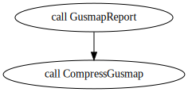

## EmpiricalSNPCalling

### Overview

The `EmpiricalSNPCalling` workflow performs the alignment of FASTQ to a reference genome, SNP calling with `GATK` tools (`HaplotypeCaller`, `GenomicsDBImport`, and `GenotypeGVCFs`), `TASSEL`, `STACKs` and `Freebayes`. The samples are split into chunks to be run in different nodes and optimize the analyses. Set the number of samples by chunk in the `chunk_size` input. Use `max_cores` to define the number of cores to be used in each node.

The workflow also includes de options to:

* Remove of not the read duplicates
* Perform the Hard Filtering in `GATK` results
* Replace the VCF AD format field with counts from BAM files
* Run `MCHap` software to build haplotypes based on `GATK` called markers

This workflow requires:

* Diploid or polyploid specie
* Single-end and paired-end reads

<center>

**Workflow**


</center>

<br/><br/>

<center>

**Subworkflows**


<br/><br/>


<br/><br/>


<br/><br/>


<br/><br/>


<br/><br/>

</center>

### Input files

The `EmpiricalSNPcalling` requires demultiplexed and cleaned FASTQ files. We made available a suggestion for preprocessing reads in `PreprocessingReads.wdl`.

`EmpiricalSNPcalling` receive as inputs:

**samples_info**: 

For single-end reads: tsv file with the first column with the path to FASTQ files, a second column with sample names, and the third column with sample names and lane specifications. Example:

```
tests/data/Ptremula_PRJNA395596_subset/fastq/SRR6249787.sub.fastq   I_3_55  I_3_55.Lib1_C09_AGAAGTC
tests/data/Ptremula_PRJNA395596_subset/fastq/SRR6249788.sub.fastq   I_3_66  I_3_66.Lib1_D06_GCCAACT
tests/data/Ptremula_PRJNA395596_subset/fastq/SRR6249795.sub.fastq   PT_F    PT_F.Lib1_E09_TGAACAT
tests/data/Ptremula_PRJNA395596_subset/fastq/SRR6249808.sub.fastq   PT_M    PT_M.Lib2_E06_CGATGCG
```

For pair-end reads: tsv file with the first column with the path to FASTQ files with forward reads (R1), a second column with the path to FASTQ files with reverse reads (R2), the third column with sample names, and the fourth column with sample names and lane specifications. Example:

```
tests/data/Ptremula_PRJNA395596_subset/fastq/SRR6249787.R1.sub.fastq    tests/data/Ptremula_PRJNA395596_subset/fastq/SRR6249787.R2.sub.fastq   I_3_55  I_3_55.Lib1_C09_AGAAGTC
tests/data/Ptremula_PRJNA395596_subset/fastq/SRR6249787.R1.sub.fastq    tests/data/Ptremula_PRJNA395596_subset/fastq/SRR6249787.R2.sub.fastq   I_3_66  I_3_66.Lib1_D06_GCCAACT
tests/data/Ptremula_PRJNA395596_subset/fastq/SRR6249787.R1.sub.fastq    tests/data/Ptremula_PRJNA395596_subset/fastq/SRR6249787.R2.sub.fastq   PT_F    PT_F.Lib1_E09_TGAACAT
tests/data/Ptremula_PRJNA395596_subset/fastq/SRR6249787.R1.sub.fastq    tests/data/Ptremula_PRJNA395596_subset/fastq/SRR6249787.R2.sub.fastq   PT_M    PT_M.Lib2_E06_CGATGCG
```

**pair_end**: "true" if data set contain pair-end reads

**ploidy**: specie ploidy

**n_chrom**: specie number of chromosomes (this is used to parallelize `freebayes` in nodes)

**chunk_size**: how many samples are to be evaluated by `GATK` in a single same node

**max_cores**: maximum number of cores to be used by alignment and `freebayes` tasks

**max_ram**: maximum raw allowed in `GATK` and `TASSEL` tasks (megabyte)

**empirical.references**

- ref_fasta: chromosome sequence in fasta format (only one chromosome at a time)

- ref_fasta_index: index made by samtools faidx

- ref_dict: index made by picard dict

- ref_sa: index made by bwa index

- ref_amb: index made by bwa index

- ref_bwt: index made by bwa index

- ref_ann: index made by bwa index

- ref_pac: index made by bwa index

You can use the following containers to create these indexes. Example:

```
docker run -v $(pwd):/data/ us.gcr.io/broad-gotc-prod/genomes-in-the-cloud:2.5.7-2021-06-09_16-47-48Z samtools faidx tests/data/PtrichocarpaV3.0/Chr10.11.2M.fa
docker run -v $(pwd):/data/ us.gcr.io/broad-gotc-prod/genomes-in-the-cloud:2.5.7-2021-06-09_16-47-48Z /usr/gitc/./bwa index tests/data/PtrichocarpaV3.0/Chr10.11.2M.fa
docker run -v $(pwd):/data/ us.gcr.io/broad-gotc-prod/genomes-in-the-cloud:2.5.7-2021-06-09_16-47-48Z java -jar /usr/gitc/picard.jar CreateSequenceDictionary R=tests/data/PtrichocarpaV3.0/Chr10.11.2M.fa O=tests/data/PtrichocarpaV3.0/Chr10.11.2M.dict
```

**rm_dupli**: if workflow should ("true") or not ("false") remove the duplicated sequences from the alignment file before the SNP calling analysis

**replaceAD**: if allele depth (AD) in VCFs generated by `GATK` and `freebayes` should be replaced by allele depth from alignment files (BAM)

**run_gatk**: "true" for running `GATK`

**hardfilters**: "true" for performing Hard filtering in `GATK` results (see more about it [here](https://gatk.broadinstitute.org/hc/en-us/articles/360035890471-Hard-filtering-germline-short-variants))

**gatk_mchap**: "true" for running `MCHap` in `GATK` results

**run_freebayes**: "true" for running `freebayes`

**run_tassel**: "true" for running `TASSEL`

**run_stacks**: "true" for running `STACKs`

**enzyme**: enzyme name (required only if running `TASSEL`)

**pop_map**: population map file (used running `STACKs`, if not specified a single populations is considered)

**P1** and **P2**: used to filter markers by segregation if running `MCHap`

The inputs: **GatkGenotyping.vcf_simu**, **GatkGenotyping.depth**, **FreebayesGenotyping.vcf_simu**, **GatkGenotyping.seed** can be ignored when running for Empirical reads. They are exclusive for simulations.

The files outputted by `EmpiricalSNPCalling.wdl` are inputs for `EmpiricalMaps.wdl`. However, we suggest checking the VCF markers' quality parameters to apply proper filters before proceeding to `EmpiricalMaps.wdl`. The `EmpiricalMaps.wdl` is limited to running only one chromosome, make sure you filter the VCF to retain only the selected one.

## EmpiricalMaps

### Overview

The `EmpiricalMaps` workflow receives as input VCF files from `EmpiricalSNPCalling` workflow and results in linkage maps for a single chromosome running the possible combinations of:

* SNP calling: `GATK`, `TASSEL`, `STACKs` and `Freebayes`
* Dosage/genotype calling: `updog`, `polyRAD` and `SuperMASSA`
* Linkage map build software: `OneMap` 3.0, `MAPpoly`, and `GUSMap`
* Using genotype probabilities from `GATK`, `Freebayes`, `TASSEL`, `STACKs`, `updog`, `polyRAD` and `SuperMASSA`, and a global error rate of 5% and 0.001% in the `OneMap` or `MAPpoly` HMM.

It also has the options to:

* Include or not multiallelic (MNP) markers
* Apply filters using `bcftools`

This workflow uses:

* Diploid bi-parental F1 population
* Genomic positions for markers order

<center>

**Subworkflows**


<br/><br/>


<br/><br/>



<br/><br/>


<br/><br/>

</center>

### Input files

**vcfs**: array with vcfs files. You can include one or more VCFs. It should be written in the format: "Maps.vcfs": ["path/to/vcf1.vcf", "path/to/vcf2.vcf", "path/to/vcf3.vcf"]

**vcfs_software**: array with SNP calling software used to generate each one of the specified VCFs in the **vcfs** input. Format example: "Maps.vcfs_software": ["GATK", "GATK", "freebayes"]

**vcfs_counts_source**: array with counts source information of each one of the VCFs in the **vcfs** input. This feature is related with the option **ReplaceAD** described in the `EmpiricalSNPCalling` section. Format example: "Maps.vcfs_counts_source": ["VCF", "BAM", "VCF"]


**dataset**
- parent1: parent 1 ID
- parent2: parent 2 ID
- name: experiment ID
- chromosome: chromosome being evaluated (only one allowed)
- cross: cross type (by now, only F1 is available)
- multiallelics: consider or not the multiallelic markers

**max_cores**: maximum number of CPUs to be used in parallelized process

**gatk_mchap**: "true" if `MCHap` was used in `GATK` results

**gatk_vcf_multi**: vcf file resulted from `MCHap` (only required if **gatk_mchap** is "true")

**filters**: specify filters to be applied by `bcftools`

**filter_segr**: "true" to filter markers by segregation distortion

**filter_noninfo**: filter out markers that are not informative (aa x bb, aa x NA, or vice-versa in outcrossing populations) before running the genotype/dosage calling

**prob_thres**: define threshold for filtering genotypes by their genotype probabilities

**ploidy**: define specie ploidy. If 2, the workflow will run OneMap and GUSMap, if higher than 2, it will run MAPpoly.

**replaceADbyMissing**: if "true", it replace the allele depth (AD) field in input VCF file by missing (0,0) if the genotype (GT) is missing (./.)

**run_supermassa**: if "true", run SuperMASSA genotype caller

**run_polyrad**: if "true", run polyrad genotype caller

**run_updog**: if "true", run updog genotype caller

**run_gusmap**: if "true", run gusmap genotype caller and linkage map builder

**genoprob_error**: if "true", the genotype probabilities from the genotype call software will be applied in the OneMap HMM approach to estimate the linkage map genetic distances

**global_errors**: array with global error values to be applied in the OneMap HMM approach to estimate the linkage map genetic distances. Example: ["0.05", "0.001"].

**genoprob_global_errors**: array with global error values to be applied in the OneMap HMM approach to estimate the linkage map genetic distances combined with the genotype call software genotype probability. Example: ["0.05", "0.001"].
