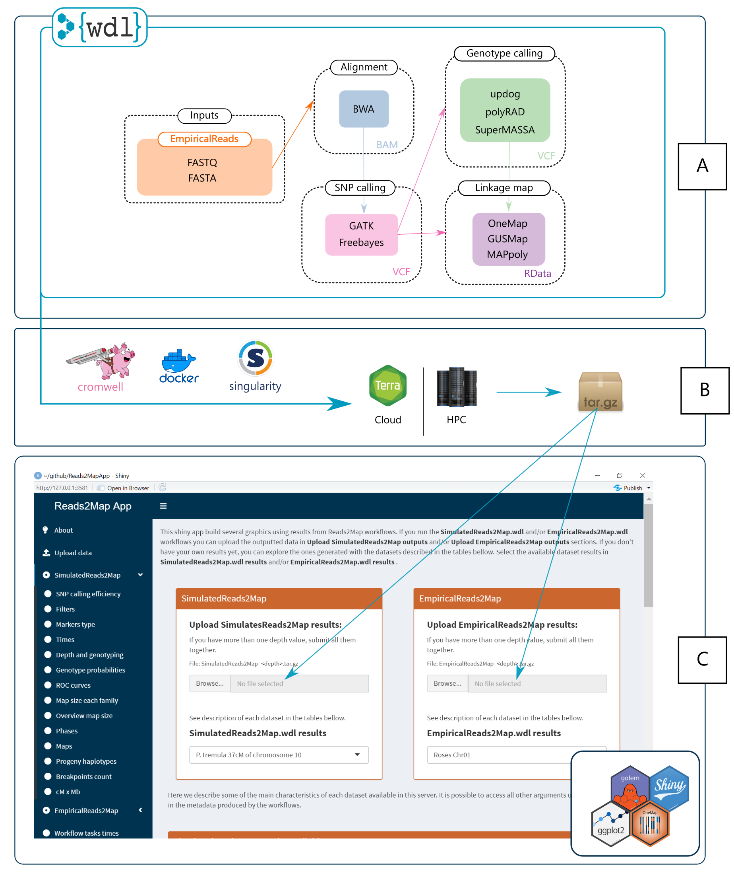
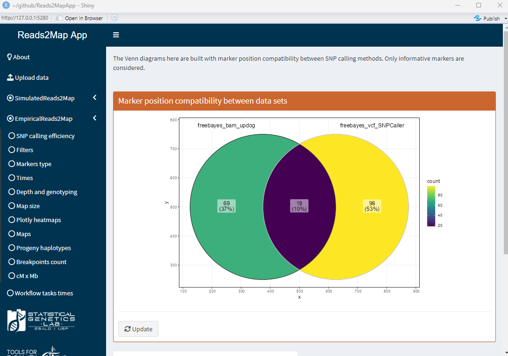

# Overview

<p align="center">
 
<p/>

# Why use Reads2Map workflows?

* **Get good quality markers from sequencing data for linkage map building**: Reads2Map simplifies the execution of commonly used tools for SNP and genotype/dosage calling, as well as linkage map building, specifically designed for a subset of the data. It provides a user-friendly interface to easily run these tools. The generated output from Reads2Map can be conveniently uploaded to the Reads2MapApp, which generates diagnostic graphics. These graphics serve as a valuable resource in selecting the optimal pipeline for your specific data set. By leveraging Reads2Map and the accompanying app, you can streamline your data analysis and make informed decisions based on the diagnostic visuals provided.

* **FAIR principles (Findability, Accessibility, Interoperability, and Reuse)**: the usage of Docker/Singularity containers provide version control of the operational system and all software used to run the analysis in each one of the tasks. Furthermore, the WDL structure guarantee that the inputs and outputs of each tasks are communication the same way. These features make the Reads2Map analysis to be the same independent of which machine you run it. It could be different operation system, in local, HPC or Cloud environments. These workflows are also available in multiple platforms such as GitHub, SciCrunch, biotools, and workflowhub.

* **Save cache**: you can setup tools to run the WDL workflows that keep cache of previous analysis so you would not need to re-run entire workflow if you want to change one task parameter or if a task did not work because of wrong inputs or lake of computational resources. In this tutorial, we describe how to setup call caching in local or HPC environments. 

* **Collaborative work**: the WDL structure and related tools have a large and active developer community that consistently releases updates to improve workflow execution. These updates enhance performance, fix bugs, and introduce new features, ensuring a streamlined and efficient experience for users. The collaborative efforts of the community foster innovation and adaptability to meet evolving user needs. The SNP and dosage/genotype calling, as well as linkage map building software, have a large community of users who apply these tools in various contexts. Reads2Map simplifies the execution of pipelines and offers analysis diagnostic graphics to assess linkage map quality. The feedback from these diverse users, utilizing the software in different contexts, plays a crucial role in enhancing and expanding Reads2Map's features. This valuable user feedback drives continuous improvement and ensures that Reads2Map remains a versatile and effective tool for its community.

* **Tools for running and visualizing the process**: the expansive community behind the evolution of WDL workflows has led to the development of various tools that aid in setting up, running, controlling, and visualizing the process. In this tutorial, we utilize the Pumbaa and Caper tools, but there are numerous other options available that you can explore. Additionally, Reads2Map offers a complementary shiny app that facilitates the swift generation of diagnostic graphics for linkage maps.

# Setup to run WDL workflows

You can find a couple of ways of running WDL workflows at the [OpenWDL github page](https://github.com/openwdl/wdl). The best method to choose will depend on what system you have available for your analysis. We have been digging into these tools for a while and here we will describe the ways we consider more practical for each one of the scenarios:

1) You do not have enough local computational resources neither access to a HPC: use [Terra.bio](https://terra.bio/)

2) You have enough local computational resources: use the tool [Pumbaa](https://github.com/lmtani/pumbaa)

3) You do not have enough local computational resources but have access to a HPC: use the wrapper [Caper](https://github.com/ENCODE-DCC/caper)

## Setup in Terra.bio

What we like about `Terra.bio`: We consider the most practical way of running a WDL workflow; provides many ways of visualization of the processes; community support

The easiest way of running the Reads2Map workflows is using the Terra.bio platform. The Broad Institute team provide comprehensive tutoriais on how to manage Terra interface, how to submit your data and the Cloud service price evaluation. You can pull Reads2Map workflows from the workflowhub: [EmpiricalReads2Map](https://doi.org/10.48546/WORKFLOWHUB.WORKFLOW.409.1) and [SimulatedReads2Map](https://doi.org/10.48546/WORKFLOWHUB.WORKFLOW.410.1)

## Setup to run locally with `Pumbaa`

What we like about `Pumbaa`: easy to install and use;  easy setup of server and Call cache; many options of visualization of the process.

The `Pumbaa` tool was developed by one of Reads2Map authors (Lucas Taniguti) and provides a easy way to set up, run the workflows, visualize the submitted runs status, and search for results. It requires [`Docker`]().

```{bash, eval=FALSE}
# Download and install Pumbaa
curl https://raw.githubusercontent.com/lmtani/pumbaa/main/assets/install.sh | bash

# Download Cromwell and follow instructions to start Mysql and Cromwell server:
pumbaa local-deploy
```

The `local-deploy` command will give instructions on how to start a MySQL and Cromwell server. Leave the server running in a terminal and open another to submit the jobs as described in the section [`Run workflows`](#Run-Reads2Map-WDL-workflows)

## Setup to run in High performance computing (HPC) with `Caper`

What we like about `Caper`: do not require MySQL to Call Cache; adaptability to different systems; provide easy way to edit backend in case of HPC specificity; easy to use

Install `Caper` with pip:

```{bash, eval=FALSE}
module load GCCcore/12.2.0 Python/3.10.8  # Libraries required for using pip in my specific HPC (search the ones in yours)
module load Java/17.0.2 # Java will also be required to run Caper
pip install --target=/scratch/user/chtaniguti/caper caper  # I didn't install it in the home directory because I have limited space/number of files there
export PATH=$PATH:/scratch/user/chtaniguti/caper/bin/ # You can add this line to the .bashrc file usually located in the home directory to avoid the need of running it every time you connect
```

Caper has many options for configurations depending on your system. Here, we show how to run in an HPC with slurm management system and singularity containers. Please, check [Caper documentation](https://github.com/ENCODE-DCC/caper/blob/master/DETAILS.md) for other options.

```{bash, eval=FALSE}
# Create a default.conf in my home directory
caper init slurm 
```

As I said before, I don't have much space in my home directory, so I opened the `default.conf` file and changed the `local-loc-dir`. I also changed the resources for the leader job, reducing the default time and memory because we are running just a subset in this tutorial. Check [here](https://github.com/ENCODE-DCC/caper/blob/master/docs/resource_param.md) other options of configuration in `default.conf`.

```console
local-loc-dir=/scratch/user/chtaniguti/caper

slurm-leader-job-resource-param=-t 2:00:00 --mem 4G
```

To pull the singularity images, we will need to have internet access. My HPC requires a specific module to provide internet access to the nodes. Because of these particularity, I needed to modify the backend configurations of caper. They explain how to do it in [this section](https://github.com/ENCODE-DCC/caper/blob/master/DETAILS.md#how-to-override-capers-built-in-backend) of their documentation. Also, because of the space, I need to modify the default directories for singularity cache and images.

I simply added the `module load WebProxy` and the singularity files paths just before running singularity to the slurm configuration code:

```
    mkdir -p $HOME/.singularity/lock/
    
    # Added #
    module load WebProxy
    export SINGULARITY_CACHEDIR=/scratch/user/chtaniguti/.singularity
    export SINGULARITY_BINDPATH=/scratch/user/chtaniguti/.singularity
    #########
    
    flock --exclusive --timeout 600 \
        $HOME/.singularity/lock/`echo -n '${singularity}' | md5sum | cut -d' ' -f1` \
        singularity exec --containall ${singularity} echo 'Successfully pulled ${singularity}'

```

# Run Reads2Map WDL workflows

We will use a subset of the Aspen diploid RADseq data (BioProject PRJNA395596) to exemplify the usage of the Reads2Map workflows.

## Run SNPCalling

#### Download materials

```{bash, eval=FALSE}
mkdir Reads2Map_tutorial
cd Reads2Map_tutorial

wget https://github.com/Cristianetaniguti/Reads2Map/raw/main/tests/data/Ptremula_PRJNA395596_subset/fastq/SRR6249787.sub.fastq
wget https://github.com/Cristianetaniguti/Reads2Map/raw/main/tests/data/Ptremula_PRJNA395596_subset/fastq/SRR6249788.sub.fastq
wget https://github.com/Cristianetaniguti/Reads2Map/raw/main/tests/data/Ptremula_PRJNA395596_subset/fastq/SRR6249795.sub.fastq
wget https://github.com/Cristianetaniguti/Reads2Map/raw/main/tests/data/Ptremula_PRJNA395596_subset/fastq/SRR6249808.sub.fastq
wget https://github.com/Cristianetaniguti/Reads2Map/raw/main/tests/data/Ptremula_PRJNA395596_subset/fastq/samples_info_pop_sub.tsv

wget https://github.com/Cristianetaniguti/Reads2Map/raw/develop/tests/data/PtrichocarpaV3.0/Chr10.11.2M.fa
```

We will also need the indexes for the reference genome:

```{bash, eval=FALSE}
docker run -v $(pwd):/opt/ kfdrc/bwa-picard:latest-dev bwa index /opt/Chr10.11.2M.fa

docker run -v $(pwd):/opt/ kfdrc/bwa-picard:latest-dev  java -jar /picard.jar CreateSequenceDictionary \
    R=/opt/Chr10.11.2M.fa \
    O=/opt/Chr10.11.2M.dict
    
docker run -v $(pwd):/opt/ cristaniguti/r-samtools:latest samtools faidx /opt/Chr10.11.2M.fa
```

Select the workflow version in the [releases page](https://github.com/Cristianetaniguti/Reads2Map/releases) and download it:

```{bash, eval=FALSE}
wget https://github.com/Cristianetaniguti/Reads2Map/releases/download/EmpiricalSNPCalling_develop/EmpiricalSNPCalling_develop.wdl
wget https://github.com/Cristianetaniguti/Reads2Map/releases/download/EmpiricalSNPCalling_develop/EmpiricalSNPCalling_develop.zip
wget https://github.com/Cristianetaniguti/Reads2Map/releases/download/EmpiricalSNPCalling_develop/EmpiricalSNPCalling_develop.inputs.json
```

See [inputs description](https://cristianetaniguti.github.io/Tutorials/Reads2Map/EmpiricalReads.html) and edit the options and paths (absolute paths) in `EmpiricalSNPCalling_develop.inputs.json`:

```
{
  "SNPCalling.max_cores": 2,
  "SNPCalling.pair_end": false,
  "SNPCalling.enzyme": "HindIII",
  "SNPCalling.max_ram": 2000,
  "SNPCalling.ploidy": 2,
  "SNPCalling.rm_dupli": false,
  "SNPCalling.run_gatk": true,
  "SNPCalling.run_freebayes": false,
  "SNPCalling.run_tassel": true,
  "SNPCalling.run_stacks": false,
  "SNPCalling.hardfilters": true,
  "SNPCalling.n_chrom": 1,
  "SNPCalling.chunk_size": 1,
  "SNPCalling.samples_info": "/home/chtaniguti/Reads2Map_tutorial/samples_info_pop_sub.tsv",
  "SNPCalling.references": {
    "ref_fasta": "/home/chtaniguti/Reads2Map_tutorial/Chr10.11.2M.fa",
    "ref_dict": "/home/chtaniguti/Reads2Map_tutorial/Chr10.11.2M.dict",
    "ref_ann": "/home/chtaniguti/Reads2Map_tutorial/Chr10.11.2M.fa.ann",
    "ref_sa": "/home/chtaniguti/Reads2Map_tutorial/Chr10.11.2M.fa.sa",
    "ref_amb": "/home/chtaniguti/Reads2Map_tutorial/Chr10.11.2M.fa.amb",
    "ref_pac": "/home/chtaniguti/Reads2Map_tutorial/Chr10.11.2M.fa.pac",
    "ref_bwt": "/home/chtaniguti/Reads2Map_tutorial/Chr10.11.2M.fa.bwt",
    "ref_fasta_index": "/home/chtaniguti/Reads2Map_tutorial/Chr10.11.2M.fa.fai"
  }
}
```

Also edit the path in `samples_info_pop_sub.tsv`:

```
/home/chtaniguti/Reads2Map_tutorial/SRR6249787.sub.fastq   I_3_55  I_3_55.Lib1_C09_AGAAGTC
/home/chtaniguti/Reads2Map_tutorial/SRR6249788.sub.fastq   I_3_66  I_3_66.Lib1_D06_GCCAACT
/home/chtaniguti/Reads2Map_tutorial/SRR6249795.sub.fastq   PT_F    PT_F.Lib1_E09_TGAACAT
/home/chtaniguti/Reads2Map_tutorial/SRR6249808.sub.fastq   PT_M    PT_M.Lib2_E06_CGATGCG
```

See an sample file format example for `pair-end` reads [here](https://github.com/Cristianetaniguti/Reads2Map/blob/develop/tests/data/polyploid/fastq/pair_end/samples_info.txt).

#### If running locally with Docker

```{bash, eval=FALSE}
pumbaa submit -w EmpiricalSNPCalling_develop.wdl -i EmpiricalSNPCalling_develop.inputs.json -d EmpiricalSNPCalling_develop.zip
```

```console
2023/05/25 17:43:05 POST request to: http://127.0.0.1:8000/api/workflows/v1
🐖 Operation= 8a9f091e-53ba-4fe0-bc4a-e68b03751050 , Status=Submitted
```

You can check the job log in the terminal that the server is on. Or also check the job status with:

```{bash, eval=FALSE}
pumbaa q
```

```console
2023/05/25 17:43:48 GET request to: http://127.0.0.1:8000/api/workflows/v1/query?submission=2023-05-18T17%3A43%3A48.269Z
+--------------------------------------+-----------------------------+-------------------+----------+-----------+
|              OPERATION               |            NAME             |       START       | DURATION |  STATUS   |
+--------------------------------------+-----------------------------+-------------------+----------+-----------+
| 392e2620-5174-4a0d-8ce3-15d71ce52bf4 | SNPCalling                  | 2023-05-25 22h43m | 37s      | Running   |
```

More details:

```{bash, eval=FALSE}
pumbaa metadata -o 392e2620-5174-4a0d-8ce3-15d71ce52bf4 
```

```console
2023/05/25 18:04:16 GET request to: http://127.0.0.1:8000/api/workflows/v1/392e2620-5174-4a0d-8ce3-15d71ce52bf4/metadata?excludeKey=executionEvents&excludeKey=jes&excludeKey=inputs
+-----------------------------+---------+---------------+---------+
|            TASK             | ATTEMPT |    ELAPSED    | STATUS  |
+-----------------------------+---------+---------------+---------+
| CreateAlignmentFromFamilies | 1       | 58.559950841s | Running |
| TasselGenotyping            | 1       | 56.529955802s | Running |
+-----------------------------+---------+---------------+---------+
```

Once is done:

```console
2023/05/25 18:27:11 GET request to: http://127.0.0.1:8000/api/workflows/v1/392e2620-5174-4a0d-8ce3-15d71ce52bf4/metadata?excludeKey=executionEvents&excludeKey=jes&excludeKey=inputs
+-----------------------------+---------+-----------+--------+
|            TASK             | ATTEMPT |  ELAPSED  | STATUS |
+-----------------------------+---------+-----------+--------+
| CreateAlignmentFromFamilies | 1       | 1m21.943s | Done   |
| GatkGenotyping              | 1       | 4m33.297s | Done   |
| TasselGenotyping            | 1       | 2m4.906s  | Done   |
+-----------------------------+---------+-----------+--------+
```

Check the output paths:

```{bash, eval=FALSE}
pumbaa outputs -o 392e2620-5174-4a0d-8ce3-15d71ce52bf4
```

```console
2023/05/25 18:29:20 GET request to: http://127.0.0.1:8000/api/workflows/v1/392e2620-5174-4a0d-8ce3-15d71ce52bf4/outputs
{
   "SNPCalling.Plots": "/home/chtaniguti/cromwell-executions/SNPCalling/392e2620-5174-4a0d-8ce3-15d71ce52bf4/call-GatkGenotyping/GatkGenotyping/a092e922-10d7-46b0-b71d-8a2c11375faf/call-HardFilteringEmp/HardFilteringEmp/e852c953-4186-4ff4-bea0-bcf6794af27d/call-QualPlots/execution/QualPlots.tar.gz",
   "SNPCalling.freebayes_vcfEval": null,
   "SNPCalling.gatk_multi_vcf": null,
   "SNPCalling.gatk_vcfEval": "/home/chtaniguti/cromwell-executions/SNPCalling/392e2620-5174-4a0d-8ce3-15d71ce52bf4/call-GatkGenotyping/GatkGenotyping/a092e922-10d7-46b0-b71d-8a2c11375faf/call-Normalization/Normalization/1cf815cf-4954-419a-869b-e7a33798687a/call-VariantEval/execution/vcfEval.txt",
   "SNPCalling.merged_bam": "/home/chtaniguti/cromwell-executions/SNPCalling/392e2620-5174-4a0d-8ce3-15d71ce52bf4/call-CreateAlignmentFromFamilies/CreateAlignmentFromFamilies/c2f27156-397d-4184-8620-0e7d2658edbf/call-MergeBams/execution/merged.bam",
   "SNPCalling.stacks_multiallelics": null,
   "SNPCalling.vcfs": [
      "/home/chtaniguti/cromwell-executions/SNPCalling/392e2620-5174-4a0d-8ce3-15d71ce52bf4/call-GatkGenotyping/GatkGenotyping/a092e922-10d7-46b0-b71d-8a2c11375faf/call-Normalization/Normalization/1cf815cf-4954-419a-869b-e7a33798687a/call-BiallelicNormalization/execution/vcf_norm.vcf.gz",
      "/home/chtaniguti/cromwell-executions/SNPCalling/392e2620-5174-4a0d-8ce3-15d71ce52bf4/call-TasselGenotyping/TasselGenotyping/a978418e-60a6-4c4b-994e-c05a0ca19c37/call-TasselAfterAlign/execution/tassel.vcf"
   ],
   "SNPCalling.vcfs_counts_source": [
      "vcf",
      "vcf"
   ],
   "SNPCalling.vcfs_software": [
      "gatk",
      "tassel"
   ]
}

```

Or interactively navigate through the tasks:

```{bash, eval=FALSE}
pumbaa navigate -o 392e2620-5174-4a0d-8ce3-15d71ce52bf4
```

```console
2023/05/25 18:32:40 GET request to: http://127.0.0.1:8000/api/workflows/v1/392e2620-5174-4a0d-8ce3-15d71ce52bf4/metadata?excludeKey=executionEvents&excludeKey=submittedFiles&excludeKey=jes&excludeKey=inputs
Workflow: SNPCalling

Use the arrow keys to navigate: ↓ ↑ → ←
? Select a task:
  ▸ GatkGenotyping
    CreateAlignmentFromFamilies
    TasselGenotyping
```

#### In HPC system with SLURM + singularity

```{bash, eval=FALSE}
caper hpc submit EmpiricalSNPCalling_develop.wdl -i EmpiricalSNPCalling_develop.inputs.json --singularity -p EmpiricalSNPCalling_develop.zip --leader-job-name SNPCalling --backend-file backend.conf
```

File `backend.conf` being the one that we edit in [Setup to run in High performance computing (HPC) with `Caper`](#Setup-to-run-in-High-performance-computing-(HPC)-with-Caper)

Check run status:

```{bash, eval=FALSE}
squeue -u chtaniguti

# or

caper hpc list
```

If required to abort the job, use `caper hpc abort <JOBID>`

You can check the workflow log by opening the file named slurm-<JOBID>. The location of the outputs will be printed at the end of the log file. 

```{bash, eval=FALSE}
tail -f cromwell.out # Exit with Ctrl-C

tail -n 100 cromwell.out
```

```console
2023-05-30 14:44:57,128 cromwell-system-akka.dispatchers.engine-dispatcher-31 INFO  - SingleWorkflowRunnerActor workflow finished with status 'Succeeded'.
{
  "outputs": {
    "SNPCalling.vcfs_software": ["gatk"],
    "SNPCalling.gatk_multi_vcf": null,
    "SNPCalling.vcfs_counts_source": ["vcf"],
    "SNPCalling.Plots": "/scratch/user/chtaniguti/Reads2Map/SNPCalling/34cf00db-9ba8-4eb2-97fd-975eb58a686a/call-GatkGenotyping/GatkGenotyping/6e6e1a4a-b917-402f-ad47-6474be5331df/call-HardFilteringEmp/HardFilteringEmp/ceda7b1d-f608-4777-b332-476a8146894c/call-QualPlots/execution/QualPlots.tar.gz",
    "SNPCalling.merged_bam": "/scratch/user/chtaniguti/Reads2Map/SNPCalling/34cf00db-9ba8-4eb2-97fd-975eb58a686a/call-CreateAlignmentFromFamilies/CreateAlignmentFromFamilies/3906d99d-8d72-47f1-82ba-b29709ae7058/call-MergeBams/execution/merged.bam",
    "SNPCalling.freebayes_vcfEval": null,
    "SNPCalling.stacks_multiallelics": null,
    "SNPCalling.gatk_vcfEval": "/scratch/user/chtaniguti/Reads2Map/SNPCalling/34cf00db-9ba8-4eb2-97fd-975eb58a686a/call-GatkGenotyping/GatkGenotyping/6e6e1a4a-b917-402f-ad47-6474be5331df/call-Normalization/Normalization/be76cd00-c036-4704-87d9-b6533466d21a/call-VariantEval/execution/vcfEval.txt",
    "SNPCalling.vcfs": ["/scratch/user/chtaniguti/Reads2Map/SNPCalling/34cf00db-9ba8-4eb2-97fd-975eb58a686a/call-GatkGenotyping/GatkGenotyping/6e6e1a4a-b917-402f-ad47-6474be5331df/call-Normalization/Normalization/be76cd00-c036-4704-87d9-b6533466d21a/call-BiallelicNormalization/execution/vcf_norm.vcf.gz"]
  },
  "id": "34cf00db-9ba8-4eb2-97fd-975eb58a686a"
}
```

## Run Maps

We suggest you to check the output VCF files before proceed to build the maps. You may want to apply specific filters according to your data set. Because we are using just a subset of samples (4) for this example, we cannot use the output VCF from the `SNPCalling` as input in the `Maps`. For the `Maps` we also created a subset but this time reducing the number of markers. Download the example VCFs:

```{bash, eval=FALSE}
wget https://github.com/Cristianetaniguti/Reads2Map/raw/main/tests/data/Ptremula_PRJNA395596_subset/snpcalling_vcfs/gatk_fullpop/gatk_bam_norm_filt.recode.vcf.gz
wget https://github.com/Cristianetaniguti/Reads2Map/raw/main/tests/data/Ptremula_PRJNA395596_subset/snpcalling_vcfs/gatk_fullpop/gatk_vcf_norm_filt.recode.vcf.gz
wget https://github.com/Cristianetaniguti/Reads2Map/raw/main/tests/data/Ptremula_PRJNA395596_subset/snpcalling_vcfs/freebayes_fullpop/freebayes_bam_norm_filt.recode.vcf.gz
wget https://github.com/Cristianetaniguti/Reads2Map/raw/main/tests/data/Ptremula_PRJNA395596_subset/snpcalling_vcfs/freebayes_fullpop/freebayes_vcf_norm_filt.recode.vcf.gz
```

Select the workflow version in the [releases page](https://github.com/Cristianetaniguti/Reads2Map/releases) and download it:

```{bash, eval=FALSE}
wget https://github.com/Cristianetaniguti/Reads2Map/releases/download/EmpiricalMaps_develop/EmpiricalMaps_develop.wdl
wget https://github.com/Cristianetaniguti/Reads2Map/releases/download/EmpiricalMaps_develop/EmpiricalMaps_develop.zip
wget https://github.com/Cristianetaniguti/Reads2Map/releases/download/EmpiricalMaps_develop/EmpiricalMaps_develop.inputs.json
```

See [inputs description](https://cristianetaniguti.github.io/Tutorials/Reads2Map/EmpiricalReads.html) and edit the options and paths (absolute paths) in `EmpiricalMaps_develop.inputs.json`:

```
{
    "Maps.dataset": {
      "parent2": "PT_M",
      "name": "populus_sub",
      "parent1": "PT_F",
      "chromosome": "Chr10",
      "cross": "F1",
      "multiallelics": true
    },
    "Maps.max_cores": 2,
    "Maps.run_supermassa": "false",
    "Maps.run_gusmap": "false",
    "Maps.run_polyrad": "false",
    "Maps.run_updog": "true",
    "Maps.ploidy": 2,
    "Maps.gatk_mchap": "FALSE",
    "Maps.vcfs_counts_source": ["vcf","bam","vcf","bam"],
    "Maps.vcfs": ["/home/chtaniguti/Reads2Map_tutorial/gatk_bam_norm_filt.recode.vcf.gz",       
                  "/home/chtaniguti/Reads2Map_tutorial/gatk_vcf_norm_filt.recode.vcf.gz",          
                  "/home/chtaniguti/Reads2Map_tutorial/freebayes_bam_norm_filt.recode.vcf.gz",   
                  "/home/chtaniguti/Reads2Map_tutorial/freebayes_vcf_norm_filt.recode.vcf.gz"],                             
    "Maps.vcfs_software": ["gatk", "gatk", "freebayes", "freebayes"],
    "Maps.filter_noninfo": true,
    "Maps.replaceADbyMissing": true,
    "Maps.global_errors": ["0.01","0.05"],
    "Maps.genoprob_error": true,
    "Maps.genoprob_global_errors":["0.01","0.05"]
}
```

#### If running locally with Docker

```{bash, eval=FALSE}
pumbaa submit -w EmpiricalMaps_develop.wdl -i EmpiricalMaps_develop.inputs.json -d EmpiricalMaps_develop.zip
```

Once it finishes:

```{bash, eval=FALSE}
pumbaa q
```

```console
2023/05/30 15:42:08 GET request to: http://127.0.0.1:8000/api/workflows/v1/query?submission=2023-05-23T15%3A42%3A08.771Z
+--------------------------------------+------+-------------------+----------+-----------+
|              OPERATION               | NAME |       START       | DURATION |  STATUS   |
+--------------------------------------+------+-------------------+----------+-----------+
| 8e27954a-f477-4db0-a2c9-70f86314914e | Maps | 2023-05-30 20h21m | 19m57s   | Succeeded |
+--------------------------------------+------+-------------------+----------+-----------+
```

```{bash, eval=FALSE}
pumbaa outputs -o 8e27954a-f477-4db0-a2c9-70f86314914e
```

```{bash, eval=FALSE}
2023/05/30 15:42:55 GET request to: http://127.0.0.1:8000/api/workflows/v1/8e27954a-f477-4db0-a2c9-70f86314914e/outputs
{
   "Maps.EmpiricalReads_results": "/home/chtaniguti/Reads2Map_tutorial/cromwell-executions/Maps/8e27954a-f477-4db0-a2c9-70f86314914e/call-JointAllReports/execution/EmpiricalReads_results.tar.gz"
}
```

#### In HPC system with SLURM + singularity

```{bash, eval=FALSE}
caper hpc submit EmpiricalMaps_develop.wdl -i EmpiricalMaps_develop.inputs.json --singularity -p EmpiricalMaps_develop.zip --leader-job-name Maps --backend-file backend.conf
```

## Visualize results

The `Reads2MapApp` is a shiny app built to visualize the results from `Reads2Map`. Install it in R with:

```{r, eval=FALSE}
devtools::install_github("Cristianetaniguti/Reads2MapApp")
```

Open the app:

```{r, eval=FALSE}
Reads2MapApp::run_app()
```

Upload the `EmpiricalReads_results.tar.gz` Reads2Map output:


Explore all tabs:



Here are some characteristics that you should check before making your decision:

* **Marker ordering**: Check the recombination fraction heatmap and the cMxMb graphic to check if the genomic order agrees with your data set order. If individual markers disagree, you can consider them errors and they should be removed in further steps, but if a group of markers (a fragment) disagree, maybe there is one inversion or translocation. 

* **Marker quality**: If all markers are in a correct order but the linkage map has an inflated size, it could be due to a high error rate among the genotypes. Choose one approach that approximates the linkage map size to the size expected (about 100-150 cM if the entire chromosome).

* **Marker coverage**: Check how the markers are distributed in the genome. Avoid approaches that do not detect markers in a large portion of the genome.

* **Marker density**: Check how the markers are distributed in the linkage map. Avoid big gaps (higher than about 10 cM).

* **Marker type**: In outcrossing populations, it is important to have markers that have recombination information for both parents. These are ab x aa (OneMap notation: D1.10), aa x ab (OneMap notation: D2.15), and ab x ab (OneMap notation: B3.7). Avoid approaches that provide only ab x aa or aa x ab in a single chromosome. 

Once you selected the approach that provides the best results for your data set, you can input the respective VCF file into R and follow `OneMap` vignette to build the map for the complete data set. 

For example, if you choose the combination of GATK for SNP calling and updog for genotype calling, the VCF will be available at:

```console
/scratch/user/chtaniguti/Reads2Map/Maps/1d8a76f3-0d6b-41c1-b3c9-fc72e9e4a623/call-updogMaps/shard-0/onemapMapsEmp/5c6f5147-0669-4368-ac64-0bf2081c061c/call-ReGenotyping/execution/gatk_updog_vcf_regeno.vcf
```

This will only contain the biallelic markers. If you wish to add the multiallelics, search for the file:

```console
/scratch/user/chtaniguti/Reads2Map/Maps/1f1cced3-fca2-418c-8c36-f8fc4b22ceb5/call-splitgeno/shard-0/execution/multiallelics.vcf.gz
```

Finding these intermediary files can be a bit tricky due to the high number of directories generated. If you are using `pumbaa`, the `navigate` function can be useful for that. The graphs generated by `womtools` and are available at the [workflows description documents](https://cristianetaniguti.github.io/Tutorials/Reads2Map/EmpiricalReads.html) are also useful to help you to identify the files location.

## Adapt tasks and run sub-workflows

If you want to modify the workflows and contribute with their development you can create a Reads2Map repository fork in your github account and clone the fork into your local machine:

```{bash, eval=FALSE}
git clone https://github.com/Cristianetaniguti/Reads2Map.git
cd Reads2Map
```

The directories in the repository are organized in:

* `tasks`: if you don't want to change the workflows structure but parameters or resources used (runtime) you probably want to search for the code here

Example:

`Freebayes` RAM memory use is a bit unpredictable, you may want to change the RAM memory of this task to the maximum RAM available in the node you work in. Search for the `tasks/freebayes.wdl` and change the `memory_size`:

```
task RunFreebayes {

  input {
    File reference
    File reference_idx
    File bam
    File bai
    Int max_cores
    Int ploidy
  }

  Int disk_size = ceil(size(reference, "GiB") + size(bam, "GiB") +  50)
  Int memory_size = 300000  # I changed here!!!

  command <<<

   ln -s ~{bam} .
   ln -s ~{bai} .

   freebayes-parallel <(fasta_generate_regions.py ~{reference_idx} 100000) ~{max_cores} \
   --genotype-qualities --ploidy ~{ploidy} -f ~{reference} *bam > "freebayes.vcf"

  >>>

  runtime {
    docker: "cristaniguti/freebayes:0.0.1"
    singularity:"docker://cristaniguti/freebayes:0.0.1"
    cpu: max_cores
    # Cloud
    memory:"~{memory_size} MiB"
    disks:"local-disk " + disk_size + " HDD"
    # Slurm
    job_name: "RunFreebayes"
    mem:"~{memory_size}M"
    time: 48
  }

  meta {
    author: "Cristiane Taniguti"
    email: "chtaniguti@tamu.edu"
    description: "Split genomic regions and runs [freebayes](https://github.com/freebayes/freebayes) parallelized."
  }

  output {
    File vcf = "freebayes.vcf"
  }
}

```

After all modifications, you will need to adapt the workflow to be run by Pumbaa or Caper because these tools do not accept imports structure present in Reads2Map. To do that, use:

```{bash, eval=FALSE}
pumbaa build -wdl Reads2Map/pipelines/EmpiricalSNPCalling.wdl
```

The adapted WDL and its dependencies .zip will be available at the `releases` directory. 

* `subworkflows`: if you want to run only part of the workflows, you can find all them here

Example:

Choose which subworkflow you want to run in `subworkflows/` and adapt it to run with Pumbaa and Caper:

```{bash, eval=FALSE}
pumbaa build -wdl Reads2Map/subworkflows/gatk_genotyping.wdl
```

The adapted WDL and its dependencies .zip will be available at the `releases` directory. 

You can also use the [`womtool.jar`](https://github.com/broadinstitute/cromwell/releases) tool to create the inputs template:

```{bash, eval=FALSE}
java -jar womtool.jar inputs Reads2Map/subworkflows/gatk_genotyping.wdl
```

* `pipelines`: if you want to change the main structure of the workflows

## Contribute

Contributions are more than welcome! Please, submit pull requests to the `develop` branch. 


