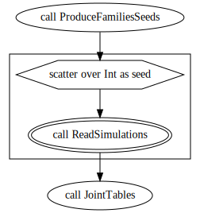
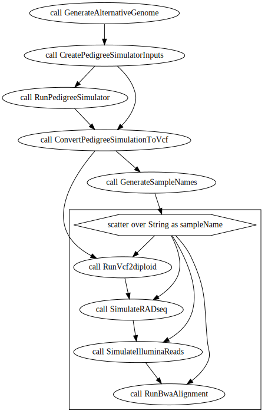
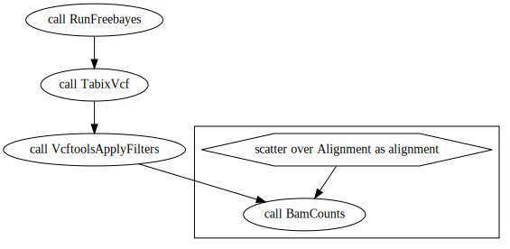
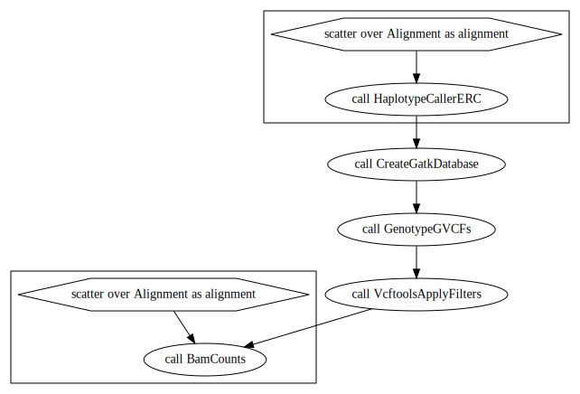
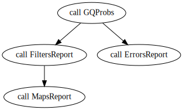
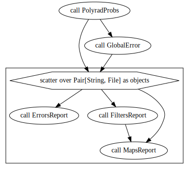

Here will be describe how to use the onemap workflows. There are two main workflows:

* SimulatedReads.wdl

This one performs the reads simulations from a input chromosome sequence for the parents and progeny of a bi-parental population, the aligment of the reads, the SNP calling in gatk and freebayes softwares and genotype calling in updog, supermassa and polyrad, and linkage maps in onemap and gusmap.

* Simulate reads

input: reference genome
output: fastq files

* Create_aligments_from_families_files

input: fastq files
output: bam files

* freebayes_genotyping.wdl

input: bam files
output: vcf file

* gatk_genotyping.wdl

input: bam files
output: vcf file

* default_maps.wdl

input: vcf files
output: RData and reports

* SNPCaller_maps.wdl

input: vcf files
output: RData and reports

* polyrad_maps.wdl

input: vcf files
output: RData and reports

* supermassa_maps.wdl

input: vcf files
output: RData and reports

* updog_maps.wdl

input: vcf files
output: RData and reports

* gusmap_maps.wdl

input: vcf files
output: RData and reports

You can also build your own workflow using tasks available in utils.wdl and utilsR.wdl
