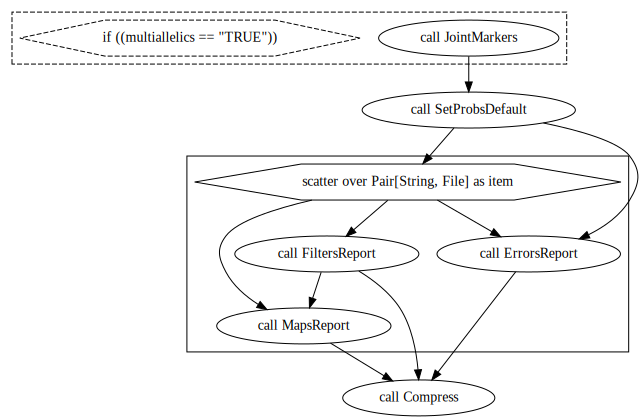

## SimulatedReads 

### Overview

This workflow performs simulations of one or more (defined by `number_of_families`) bi-parental outcrossing population haplotypes using `PedigreeSim` software based on a provided linkage map and SNP markers. It uses `RADinitio` software, the simulated haplotypes, and a reference genome to also simulate genotyping-by-sequencing read sequences. After, it performs the SNP and genotype calling and builds 68 linkage maps from the combinations:

* SNP calling: `GATK` and `Freebayes`
* Dosage/genotype calling: `updog`, `polyRAD` and `SuperMASSA`
* Linkage map build software: `OneMap` 3.0 and `GUSMap`
* Using genotype probabilities from `GATK`, `Freebayes`, `updog`, `polyRAD` and `SuperMASSA`, and a global error rate of 5% and 0.001% in the `OneMap` HMM.

It also has the options to:

* Include or not multiallelic (MNP) markers
* Apply filters using `bcftools`

This workflow uses:

* A reference linkage map
* A reference VCF file
* A single chromosome from a reference genome
* Diploid bi-parental F1 population
* Genomic positions for markers order

<center>

**Workflow**


</center>

<br/><br/>

<center>

**Subworkflows**


<br/><br/>


<br/><br/>


<br/><br/>


<br/><br/>



<br/><br/>


<br/><br/>


<br/><br/>

</center>

### Input files

First, go to our [releases page](https://github.com/Cristianetaniguti/Reads2Map/releases) and download the assets of the most recent version of the `SimulatedReads` workflow. 

You will need the following input information:

**number_of_families** : an integer defining the number of families with `popsize` individuals to be simulated

**global_seed**: This seed is used to generate the families seeds

**max_cores**: Maximum number of computer cores to be used

**filters**: filters in to be applied by `bcftools` in the VCF file after SNP calling

**chunk_size**: how many samples are to be evaluated by `GATK` in a single same node

**replaceAD**: if allele depth (AD) in VCFs generated by `GATK` and `freebayes` should be replaced by allele depth from alignment files (BAM)

**hardfilters**: true for performing Hard filtering in `GATK` results (see more about it [here](https://gatk.broadinstitute.org/hc/en-us/articles/360035890471-Hard-filtering-germline-short-variants))

**gatk_mchap**: true if `MCHap` was used in `GATK` results

**n_chrom**: specie number of chromosomes (this is used to parallelize `freebayes` in nodes)

**family**: 

- seed: seed to reproduce the analysis after - warning: some steps are still random, as the reads simulation

- popsize: number of individuals at the progeny population

- ploidy: the ploidy of the species, by now only diploid (2) species are supported

- cross: cross-type. By now, only "F1" option is available

- doses: if you do not have a VCF file with variants to be simulated, you can define here the percentage of markers with doses 0, 1, and 2 (when the cross is F1)

- cmBymb: if you do not have a reference linkage map, you can simulate using a general recombination rate according to other genetic maps of the specie

**sequencing**:

- library_type: the options RADseq, WGS, and Exome are available

- multiallelics: Define with true or false, if the analysis should try to include multiallelic markers in the linkage maps

- emp_vcf: reference VCF file with the variants to be simulated

- emp_bam: reference BAM file. It will be used to define the reads profile in WGS and Exome simulation

- ref_map: reference linkage map, it is a text file with two columns, one named "cM" with values for centimorgan position of markers and the other named "bp" with the respective base pair position of each marker. The markers in your reference map do not need to be the same as the VCF file Using splines, this map is used to train a model to define the position in centimorgan of the simulated variants in the genome

- enzyme1: If RADseq, the enzyme used to reduce the genome representation

- enzyme2: If RADseq, the second enzyme used to reduce the genome representation

- vcf_parent1: parent 1 ID in the reference VCF

- vcf_parent2: parent 2 ID in the reference VCF

- chromosome: chromosome ID to be simulated

- pcr_cycles: If RADseq, the number of PCR cycles used in the library preparation (default: 9)

- insert_size: If RADseq, define the insert size in bp (default: 350)

- read_length: If RADseq, define the read length in bp (default: 150)

- depth: sequencing depth (default: 20)

- depth_parents: sequencing depth in parents samples

- insert_size_dev: If RADseq, define the insert size standard deviation in bp (default: 35)

- mapsize: map size in centimorgan of the chromosome subset to be run

- rm_dupli: if workflow should (true) or not (false) remove the duplicated sequences from the alignment file before the SNP calling analysis


**references**

- ref_fasta: chromosome sequence in FASTA format (only one chromosome at a time, and no N are allowed)

- ref_fasta_index: index made by samtools faidx

- ref_dict: index made by picard dict

- ref_sa: index made by bwa index

- ref_amb: index made by bwa index

- ref_bwt: index made by bwa index

- ref_ann: index made by bwa index

- ref_pac: index made by bwa index

You can use the following containers to create these indexes. Example:

```
docker run -v $(pwd):/data/ us.gcr.io/broad-gotc-prod/genomes-in-the-cloud:2.5.7-2021-06-09_16-47-48Z samtools faidx tests/data/PtrichocarpaV3.0/Chr10.11.2M.fa
docker run -v $(pwd):/data/ us.gcr.io/broad-gotc-prod/genomes-in-the-cloud:2.5.7-2021-06-09_16-47-48Z /usr/gitc/./bwa index tests/data/PtrichocarpaV3.0/Chr10.11.2M.fa
docker run -v $(pwd):/data/ us.gcr.io/broad-gotc-prod/genomes-in-the-cloud:2.5.7-2021-06-09_16-47-48Z java -jar /usr/gitc/picard.jar CreateSequenceDictionary R=tests/data/PtrichocarpaV3.0/Chr10.11.2M.fa O=tests/data/PtrichocarpaV3.0/Chr10.11.2M.dict
```

## Example of how to run

Once you have all the input files, there are some options to run the workflow. See more about it on the [openwdl page](https://github.com/openwdl/wdl). 

One example is using the [`cromwell`](https://cromwell.readthedocs.io/en/stable/) engine. `Cromwell` offers different backend configurations that allow running the workflows in different management systems such as `SLURM` and `SGE`. It is also possible to set configurations to use singularity containers and `MySQL` database to keep a cache of runs. Check some of this configurations options in our [configurations files](https://github.com/Cristianetaniguti/Reads2Map/tree/main/.configurations). You can see further information about all options available in [its documentation](https://cromwell.readthedocs.io/en/stable/). To run the workflow through `cromwell`, you will need first an input file. Use the [womtool](https://github.com/broadinstitute/cromwell/releases) to generate the inputs template:

```{bash, eval=FALSE}
java -jar womtool.jar inputs SimulatedReads_v1.0.0.wdl > SimulatedReads.inputs.json
```

Adapt the input files paths and run cromwell:

```
Execute the workflow
java -jar /path/to/cromwell.jar run -p SimulatedReads_v1.0.0.zip -i SimulatedReads.inputs.json SimulatedReads_v1.0.0.wdl
```

**Warning**: This analysis demand high computer capacity to run. Check some examples of configurations in `.configurations` directory. Here are two examples of how to use them:

* For storing the metadata and cache in a `MySQL` database (see also [cromwell-cli](https://github.com/lmtani/cromwell-cli) for easy access to metadata):

```
# Open mySQL cointainer
docker run -d -v banco_cromwell:/var/lib/mysql --rm --name mysql-cromwell -p 3307:3306 -e MYSQL_ROOT_PASSWORD=1234 -e MYSQL_DATABASE=cromwell mysql:5.7

# Execute the workflow
java -jar -Dconfig.file=.configurations/cromwell_mysql.conf -jar cromwell.jar run -p SimulatedReads_v1.0.0.zip -i SimulatedReads.inputs.json SimulatedReads_v1.0.0.wdl

# Or execute the workflow through the server interface
java -jar -Dconfig.file=.configurations/cromwell_mysql.conf -jar cromwell.jar server
```

In case you use the server interface, you must open it in your browser in the pointed local address and submit the input (`.json`), workflow (`.wdl`), and the directories struct and tasks compressed (`.zip`).

* If you are using a High-Performance Computing (HPC) with slurm management system:

BATCH file named `slurm_main.sh`:

```
#!/bin/bash

#SBATCH --export=NONE
#SBATCH -J cromwell_Reads2Map
#SBATCH --nodes=1                    
#SBATCH --mem=1G
#SBATCH --time=01:30:00
#SBATCH -o /home/user/Reads2Map.log
#SBATCH -e /home/user/Reads2Map.err

# Maybe it will be required to import java and singularity modules here. Check the specifications of the HPC.
#module load singularity
#module load java

java -jar -Dconfig.file=/home/user/Reads2Map/.configurations/cromwell_no_mysql.conf \
     -jar /home/user/Reads2Map/cromwell-65.jar \
     run /home/user/Reads2Map/SimulatedReads_v1.0.0.wdl \
     -p SimulatedReads_v1.0.0.zip \
     -i /home/user/Reads2Map/inputs/SimulatedReads.inputs.json 
```

When the run is ended, the log description printed on the screen will point to the path for the workflow output files. 

## Generating the workflows graphs

The figures of this tutorial were generated using `womtool` and `graphviz`. Example:

```{bash, eval=FALSE}
java -jar womtool-84.jar graph SimulatedReads.wdl > SimulatedReads.gv   
dot -Tsvg SimulatedReads.gv > SimulatedReads.svg
```

## Visualize `Reads2Map` workflows output in `Reads2MapApp`

You can search for all workflow's intermediary files in the `cromwell-executions` directory generated by the Cromwell. The `log` file will specify the workflow id and path for each executed task. The final output of `EmpiricalMaps.wdl` and `SimulatedReads.wdl` are compressed files called `EmpiricalReads_results.tar.gz` and `SimulatedReads_results.tar.gz`. These files contain tables for an overview of the entire procedure. They are inputs for the `Reads2MapApp`, a shiny app that provides a graphical view of the results. Check the [Reads2MapApp repository](https://github.com/Cristianetaniguti/Reads2MapApp) for further information.

