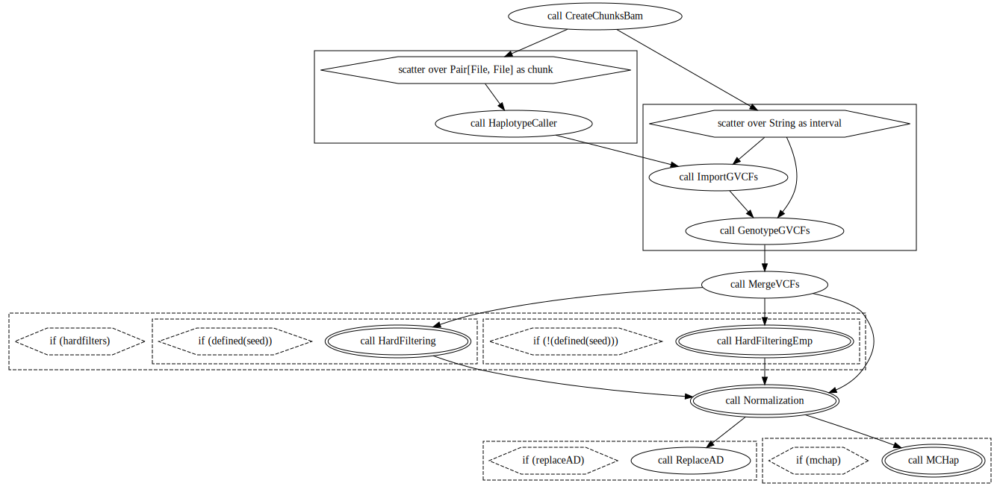
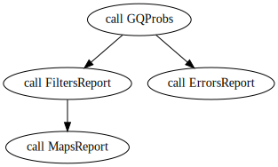
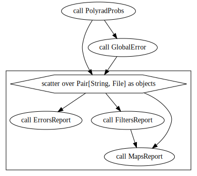

## Run SimulatedReads workflow

* Adapt the path of the inputs in `inputs/SimulatedReads.input.json`

**number_of_families** : an integer defining the number of families with `popsize` individuals to be simulated;

**global_seed**: This seed is used to generate the families seeds;

**max_cores**: Maximum number of computer cores to be used;

**filters**: filters in to be applied by VCFtools in the VCF file after SNP calling;

**chunk_size**: how many samples are to be evaluated by GATK in a single same node

**family**: 
- seed: seed to reproduce the analysis after - warning: some steps are still random, as the reads simulation;
- popsize: number of individuals at the progeny population;
- ploidy: the ploidy of the species, by now only diploid (2) species are supported;
- cross: cross-type. By now, only "F1" option is available;
- doses: if you do not have a VCF file with variants to be simulated, you can define here the percentage of markers with doses 0, 1, and 2 (when the cross is F1);
- cmBymb: if you do not have a reference linkage map, you can simulate using a general recombination rate according to other genetic maps of the specie

**sequencing**:
- library_type: the options RADseq, WGS, and Exome are available.
- multiallelics: Define with "TRUE" or "FALSE", if the analysis should try to include multiallelic markers in the linkage maps.
- emp_vcf: reference VCF file with the variants to be simulated.
- emp_bam: reference BAM file. It will be used to define the reads profile in WGS and Exome simulation.
- ref_map: reference linkage map, it is a text file with two columns, one named "cM" with values for centimorgan position of markers and the other named "bp" with the respective base pair position of each marker. The markers in your reference map do not need to be the same as the VCF file. Using splines, this map is used to train a model to define the position in centimorgan of the simulated variants in the genome.  
- enzyme1: If RADseq, the enzyme used to reduce the genome representation.
- enzyme2: If RADseq, the second enzyme used to reduce the genome representation.
- vcf_parent1: parent 1 ID in the reference VCF.
- vcf_parent2: parent 2 ID in the reference VCF.
- chromosome: chromosome ID to be simulated.
- pcr_cycles: If RADseq, the number of PCR cycles used in the library preparation (default: 9).
- insert_size: If RADseq, define the insert size in bp (default: 350).
- read_length: If RADseq, define the read length in bp (default: 150).
- depth: sequencing depth (default: 20).
- insert_size_dev: If RADseq, define the insert size standard deviation in bp (default: 35).

**references**
- ref_fasta: chromosome sequence in FASTA format (only one chromosome at a time, and no N are allowed)
- ref_fasta_index: index made by samtools faidx
- ref_dict: index made by picard dict
- ref_sa: index made by bwa index
- ref_amb: index made by bwa index
- ref_bwt: index made by bwa index
- ref_ann: index made by bwa index
- ref_pac: index made by bwa index

### Run test dataset for simulations

In the directory `data/toy_simulations` you will find input files required to simulate reads and maps based on a subset of *Populus trichocarpa* chromosome 10. These files are: 1) `ref.variants.noindel.recode.vcf` a reference VCF file only with SNPs (indels are not supported by now); 2) and a reference linkage map `ref.map.csv`. The path to the files must be defined in `inputs/SimulatedReads.inputs.json`.

Run the workflow:

```
Execute the workflow
java -jar -Dconfig.file=.configurations/cromwell_cache.conf -jar cromwell.jar run -i SimulatedReads.inputs.json SimulatedReads.wdl
```

**Warning**: This analysis demand high computer capacity to run. You will be able to run the example dataset on a computer with 4G of RAM, but we suggest setting personalized configurations according to your system. Check some examples of configurations in `.configurations` directory. You can also check other option in the [Cromwell documentation](https://cromwell.readthedocs.io/en/stable/).

## Running large datasets

By default, the workflows are configurated for High-Performance Computing (HPC) services and we provide some configurations files examples in `.configurations` directory.

If you don't have an HPC available, you may want to check cloud services. There are several services available, we would suggest starting your search by the [terra.bio](https://terra.bio/resources/analysis-tools/) platform. To adapt the workflows to cloud services it is required to change the `runtime` session of the workflow tasks according to the cloud format.

The time and memory specifications in `runtime` session of each task also need to be adapted for different datasets. Consult the `Reads2MapApp` session `Workflows efficiency` to optimize the time and memory requirements for your data set. 

## Visualize Reads2Map workflows output in Reads2MapApp

You can search for all workflow's intermediary files in the `cromwell-executions` directory generated by the Cromwell. The `log` file will specify the workflow id and path for each executed task. The final output of `EmpiricalMaps.wdl` and `SimulatedReads.wdl` are compressed files called `EmpiricalReads_results.tar.gz` and `SimulatedReads_results.tar.gz`. These files contain tables for an overview of the entire procedure. They are inputs for the `Reads2MapApp`, a shiny app that provides a graphical view of the results. Check the [Reads2MapApp repository](https://github.com/Cristianetaniguti/Reads2MapApp) for further information.


Here will be describe how to use the onemap workflows. There are two main workflows:

* SimulatedReads.wdl

This one performs the reads simulations from a input chromosome sequence for the parents and progeny of a bi-parental population, the aligment of the reads, the SNP calling in gatk and freebayes softwares and genotype calling in updog, supermassa and polyrad, and linkage maps in onemap and gusmap.


* Simulate reads

input: reference genome
output: fastq files


* Create_aligments_from_families_files

input: fastq files
output: bam files


* freebayes_genotyping.wdl

input: bam files
output: vcf file


* gatk_genotyping.wdl

input: bam files
output: vcf file



* default_maps.wdl

input: vcf files
output: RData and reports


* SNPCaller_maps.wdl

input: vcf files
output: RData and reports



* polyrad_maps.wdl

input: vcf files
output: RData and reports



* supermassa_maps.wdl

input: vcf files
output: RData and reports


* updog_maps.wdl

input: vcf files
output: RData and reports


* gusmap_maps.wdl

input: vcf files
output: RData and reports


You can also build your own workflow using tasks available in utils.wdl and utilsR.wdl
