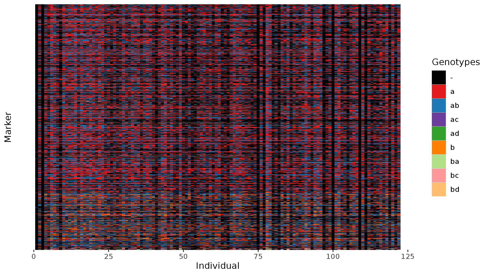
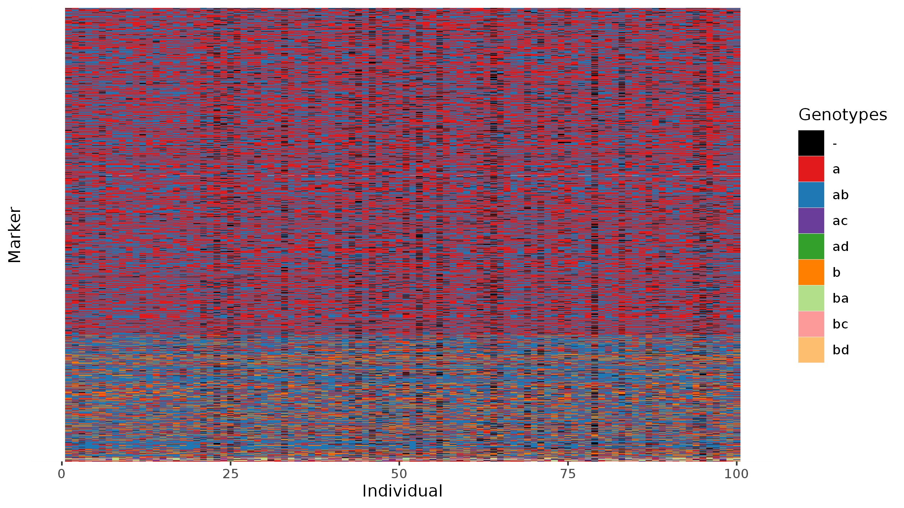
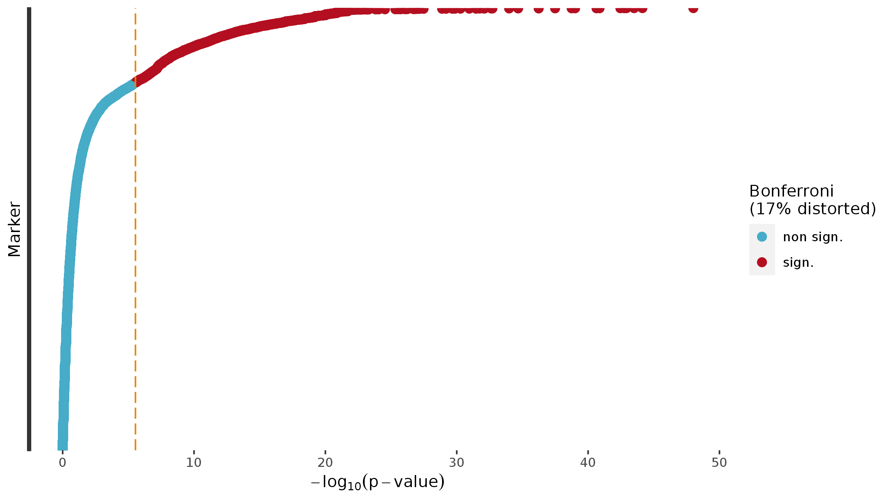

This tutorial will help you to build linkage maps using markers from sequencing technologies with OneMap 3.0. The 3.0 version of OneMap includes updates to save processing time, increase informativeness, and overcome genotyping errors. However, the quality of the resulted linkage map is related to the quality of the markers used. 

## Obtaining good quality markers

In [Taniguti et. al, 2022](), we describe the OneMap 3.0 updates and tested different combination of bioinformatic tools and filters to obtaining good quality markers and linkage maps. The [Reads2Map]() workflows allow you to make same tests in your data set. The workflow performs the alignment of read sequences, SNP and genotype calling, and linkage maps using BWA, GATK, freebayes, updog, polyRAD, superMASSA, GUSMap and OneMap. The workflows output 34 linkage maps built for a subset of your data using different software and parameters. The Reads2Map workflow results can be visualized in [Reads2MapApp](). This shiny app will provide graphics to help you to select the best combination of software and parameters for your data set based on the built linkage map quality. 

Once you selected the best pipeline (through Reads2Map or other method) and have a VCF file, you can follow this tutorial to perform the analysis for your complete data set. 

## Input data

The data set used in this tutorial is the same *Populus tremula* $F_1$ population described in [Taniguti et. al, 2022]() and [Zhigunov et. al, 2017](https://bmcplantbiol.biomedcentral.com/articles/10.1186/s12870-017-1127-y). As showed in the manuscript, this is a chalange data set because presents low-depth (~6). The SNP and genotype call was performed with GATK. 

Despite Reads2Map is available (by now) only for outcrossing populations, the steps presented in this tutorial can also be applied to inbred lines populations ($F_2$, backcross and RILs).

Use `onemap_read_vcfR` to convert the VCF file to `onemap` object. If you have multiallelic markers (MNPs) in your VCF file, set the `only_biallelics` to `FALSE`.

```{r, eval=FALSE}
library(onemap)
library(ggplot2)

onemap_obj <- onemap_read_vcfR("populus_gatk_filt.vcf.gz", parent1 = "PT_M", parent2 = "PT_F", cross = "outcross", only_biallelic = FALSE)

onemap_obj
```

```
This is an object of class 'onemap'
Type of cross:      outcross 
No. individuals:    122 
No. markers:        97106 
CHROM information:  yes 
POS information:    yes 
Percent genotyped:  69 

Segregation types:
A.1 -->  13
A.2 -->  857
B3.7 -->  21303
D1.10 -->  34586
D1.9 -->  227
D2.14 -->  261
D2.15 -->  39859

No. traits:         0 
```

```{r, eval=FALSE}
plot(onemap_obj)
```

```{r, eval=FALSE, echo=FALSE}
p <- plot(onemap_obj)

ggsave(p, file = "raw_data.png")
```



See more options for data input formats for OneMap in [Creating data file](https://statgen-esalq.github.io/tutorials/onemap/Outcrossing_Populations.html#creating-the-data-file) and [Importing data](https://statgen-esalq.github.io/tutorials/onemap/Outcrossing_Populations.html#importing-data).

## Filters

Before starting the linkage map analysis, you will need to apply some filters to garantee that the markers used are the one with higher quality among your data set. The threshold to be applied will vary according to the characteristics of your libraries and sequencing. OneMap has function to filter markers based on missing data, redundancy and segregation deviation. If you have a VCF file and wants to try other filters (e.g. minor allele frequency) we suggest using [bcftools](https://samtools.github.io/bcftools/bcftools.html).

```{r, eval=FALSE}
# Remove markers and individuals with more than 25% of missing data
onemap.obj.mis <- filter_missing(onemap_obj, 0.25, by = "markers")
onemap.obj.mis <- filter_missing(onemap.obj = onemap.obj.mis, 
                                 threshold = 0.25, 
                                 by = "individuals")

plot(onemap.obj.mis)
```

```
This is an object of class 'onemap'
Type of cross:      outcross 
No. individuals:    100 
No. markers:        19813 
CHROM information:  yes 
POS information:    yes 
Percent genotyped:  94 

Segregation types:
A.1 -->  1
A.2 -->  168
B3.7 -->  5365
D1.10 -->  6965
D1.9 -->  8
D2.14 -->  16
D2.15 -->  7290

No. traits:         0 
```

```{r, eval=FALSE, echo=FALSE}
p <- plot(onemap.obj.mis)

ggsave(p, file = "raw_data_filt.png")
```




```{r, eval=FALSE}
# Remove redundants
bins <- find_bins(input.obj = onemap.obj.mis)
onemap.obj.bins <- create_data_bins(onemap.obj.mis, bins)

segre <- test_segregation(onemap.obj.bins)
num_segre <- select_segreg(segre, distorted = F, numbers = T)
```



## Set genotypes probabilities

By default, `OneMap` sets a error probability of $10^{-5}$ for every genotype:

```{r}
head(onemap.obj.bins$error)
```

```
Chr01_100436_II_1_81 0.00001 0.00001 0.99999 0.99999
Chr01_100450_II_1_81 0.00001 0.00001 0.99999 0.99999
Chr01_118711_II_1_81 0.99999 0.99999 0.00001 0.00001
Chr01_163649_II_1_81 0.99999 0.99999 0.00001 0.00001
Chr01_188618_II_1_81 0.00001 0.00001 0.99999 0.99999
Chr01_350191_II_1_81 0.99999 0.00001 0.99999 0.00001
```

See [Taniguti et. al, 2023]() Supplementary File 1 for details about the `$error` object format.

For markers from sequencing technology, this value is unrealistic and generates inflated linkage maps. `OneMap` 3.0 can consider three types of genotype probabilities to consider error in the HMM chain. A single global value (global_error), a matrix with dimensions (number of individuals) x (number of markers) with genotypes errors values (genotypes_errors), and a matrix with dimensions (number of individuals)*(number of markers) x possible genotypes (genotypes_probs). See details in the function `create_probs`:

```{r}
?create_probs
```

If you have a VCF file,  you can use the function `extract_depth` to obtain the genotypes_errors and genotypes_probs from the GQ or PL format field:

```{r}
library(vcfR)
vcfR.object <- read.vcfR("populus_gatk_filt.vcf.gz")
genotypes_errors <- extract_depth(vcfR.object, 
                                  onemap.obj.bins, 
                                  vcf.par = "GQ", 
                                  parent1 = "PT_M", 
                                  parent2 = "PT_F")

genotypes_errors[1:5, 1:5]
```

```
Chr01_100436 Chr01_100450 Chr01_118711 Chr01_163649 Chr01_188618
II_1_81  1.258925e-10 1.258925e-10 1.000000e-03 1.995262e-03 1.258925e-10
II_3_09  7.943282e-03 7.943282e-03 5.011872e-10 1.258925e-10 2.511886e-04
II_3_10  2.511886e-07 3.981072e-07 1.258925e-04 6.309573e-02 1.000000e-07
II_3_10a 1.258925e-10 1.258925e-10 7.943282e-09 6.309573e-05 1.258925e-10
II_3_11  1.258925e-10 1.258925e-10 1.000000e-03 6.309573e-05 1.258925e-10
```

```{r}
onemap_obj_errors <- create_probs(onemap.obj.bins, genotypes_errors = genotypes_errors)
head(onemap_obj_errors$error)
```

```
Chr01_100436_II_1_81 1.258925e-10 1.258925e-10 1.000000000 1.000000000
Chr01_100450_II_1_81 1.258925e-10 1.258925e-10 1.000000000 1.000000000
Chr01_118711_II_1_81 9.990000e-01 9.990000e-01 0.001000000 0.001000000
Chr01_163649_II_1_81 9.980047e-01 9.980047e-01 0.001995262 0.001995262
Chr01_188618_II_1_81 1.258925e-10 1.258925e-10 1.000000000 1.000000000
Chr01_350191_II_1_81 9.683772e-01 3.162278e-02 0.968377223 0.031622777
```

```{r}
genotypes_probs <- extract_depth(vcfR.object, 
                                 onemap.obj.bins, 
                                 vcf.par = "PL", 
                                 parent1 = "PT_M", 
                                 parent2 = "PT_F")

genotypes_probs[1:5, 1:5]
```

```
Chr01_100436_II_1_81 3.333333e-126 3.333333e-01  0.000000e+00 3.333333e-126 3.333333e-01
Chr01_100450_II_1_81  0.000000e+00 3.333333e-01 3.333333e-106  0.000000e+00 3.333333e-01
Chr01_118711_II_1_81  2.500000e-01 2.500000e-31  0.000000e+00  2.500000e-01 2.500000e-31
Chr01_163649_II_1_81  2.500000e-01 2.500000e-28  0.000000e+00  2.500000e-01 2.500000e-28
Chr01_188618_II_1_81 3.333333e-223 3.333333e-01 3.333333e-190 3.333333e-223 3.333333e-01
```

```{r}
onemap_obj_probs <- create_probs(onemap.obj.bins, genotypes_probs = genotypes_probs)
head(onemap_obj_probs$error)
```

```
Chr01_100436_II_1_81 3.333333e-126 3.333333e-126 3.333333e-01 3.333333e-01
Chr01_100450_II_1_81  0.000000e+00  0.000000e+00 3.333333e-01 3.333333e-01
Chr01_118711_II_1_81  2.500000e-01  2.500000e-01 2.500000e-31 2.500000e-31
Chr01_163649_II_1_81  2.500000e-01  2.500000e-01 2.500000e-28 2.500000e-28
Chr01_188618_II_1_81 3.333333e-223 3.333333e-223 3.333333e-01 3.333333e-01
Chr01_350191_II_1_81  2.500000e-01  2.500000e-16 2.500000e-01 2.500000e-16
```

However, here we will use `global_error = 0.1` because [`Reads2Map`]() results showed that using 0.05 still didn't produce maps with expected size for this data set:

```{r}
onemap_obj_global <- create_probs(onemap.obj.bins, global_error = 0.1)
head(onemap_obj_global$error)
```

## Estimate two-points recombination fractions

```{r}
twopts <- rf_2pts(onemap_obj_global)
save(twopts, file = "twopts.RData")
```

## Group and order markers

The best method used to group and order markers will depend on which information are available for your data set. You can also try more than one. The recombination fraction matrix profile (`rf_graph_table` function) will define which of the methods worked better for your data set.

See more OneMap options for grouping and ordering algorithms in [](https://statgen-esalq.github.io/tutorials/onemap/Outcrossing_Populations.html#assigning-markers-to-linkage-groups) and [](https://statgen-esalq.github.io/tutorials/onemap/Outcrossing_Populations.html#genetic-mapping-of-linkage-group-3)

### Genomic grouping and ordering

If you have a good reference genome, it is a good idea to start grouping and ordering based on it and check the linkage map quality with the profile of the recombination fraction matrix. Non-assembled markers can be included later using `try_seq` function.

```{r}
chrs <- unique(onemap_obj_global$CHROM)
chrs <- chrs[1:19] # Specie expected number of chromosomes 

seq_one_chr <- rf_graphics <- list()
for(i in 1:length(chrs)){
  seq_chr <- make_seq(twopts, chrs[i])
  # genomic order
  seq_one_chr[[i]] <- make_seq(seq_chr$twopt,
                               seq_chr$seq.num[order(seq_chr$data.name$POS[seq_chr$seq.num])])
  rf_graphics[[i]] <- rf_graph_table(seq_one_chr[[i]], mrk.axis = "none")
  ggsave(rf_graphics[[i]], filename = paste0("Chr",i,".png"))
}
```


#### Filters based on two-points estimations

Only you selected your grouping and ordering method based on the overall profile of the recombination fraction matrix, you can remove outlier markers filtering by the recombination fraction information. You can do it removing them one by one (use `drop_marker` and `add_marker`) or use one of the automatic approaches:

```{r}
?rf_snp_filter_onemap
?filter_2pts_gaps
```

**Warning**: If you are using the genomic ordering, this automatic approaches can remove markers from genomic regions that have a biological explanation for being different from the reference genome such as inversions and translocations. It is important to check the recombination fraction heatmap to screen for this regions before using these filtering functions.

```{r}

filt_seq <- rf_graphics_filt <- list()
for(i in 1:length(seq_one_chr)){
  filt_seq[[i]] <- rf_snp_filter_onemap(seq_one_chr[[i]], probs = c(0.15, 0.85))
  rf_graphics_filt[[i]] <- rf_graph_table(filt_seq[[i]], mrk.axis = "none")
  ggsave(rf_graphics_filt[[i]], filename = paste0("Chr",i,"_filt.png"))
}

filt_seq2 <- rf_graphics_filt2 <- list()
for(i in 1:length(seq_one_chr)){
  filt_seq2[[i]] <- filter_2pts_gaps(filt_seq[[i]])
  rf_graphics_filt2[[i]] <- rf_graph_table(filt_seq2[[i]], mrk.axis = "none")
  ggsave(rf_graphics_filt2[[i]], filename = paste0("Chr",i,"_filt2.png"))
}

```

Remove last outliers by evaluating the interactive recombination fraction heatmap plot and using `drop_marker`.

```{r, eval= FALSE}
final.seqs <- final.graphs <- list()

# LG1
rf_graph_table(filt_seq2[[1]], inter = TRUE, html.file = "temp.html")

rm.mks <- c(66,124, 125, 130, 131, 134, 240, 242, 243, 
            621, 622, 623, 624, 777, 820, 939, 943, 
            1102, 1103, 1302, 1303, 1304, 1469, 1470,
            1656, 1658, 1733, 1734, 1765, 1766, 1918, 1921,
            1998, 1999, 2000, 2092, 2095, 2097, 2153)

final.seqs[[1]] <- drop_marker(filt_seq2[[1]], rm.mks)
final.graphs[[1]] <- rf_graph_table(final.seqs[[1]], mrk.axis = "none")

# LG 2
rf_graph_table(filt_seq2[[2]], inter = TRUE, html.file = "temp.html")

rm.mks <- c(2237, 2273, 2348, 2349, 2411, 2413,
            2467, 2468, 2469, 2530, 2531, 2532, 
            2533, 2932, 2934, 3186, 3188, 3243,
            3260, 3288, 3289, 3290, 3295, 3331,
            3332, 3359, 3360, 3399)

final.seqs[[2]] <- drop_marker(filt_seq2[[2]], rm.mks)
final.graphs[[2]] <- rf_graph_table(final.seqs[[2]], mrk.axis = "none")

# LG 3
rf_graph_table(filt_seq2[[3]], inter = TRUE, html.file = "temp.html")

rm.mks <- c(3475, 3477, 3478, 3479, 3480, 3506, 3507,
            3542, 3603, 3604, 3605, 3606, 3830, 3831,
            3564, 3565, 3566, 3576, 3577, 3659, 3660,
            3876, 3877, 3881, 3882, 3912, 3913, 4273, 
            4301, 4379, 4398, 4399)

final.seqs[[3]] <- drop_marker(filt_seq2[[3]], rm.mks)
final.graphs[[3]] <- rf_graph_table(final.seqs[[3]], mrk.axis = "none")

# LG 4
rf_graph_table(filt_seq2[[4]], inter = TRUE, html.file = "temp.html")

rm.mks <- c(4536, 4537, 4626, 4627, 4641, 4643, 4670, 4671,
            4718, 4719, 4797, 4798, 4904, 4905, 4906, 4907,
            4908, 4920, 4965, 4966, 5026, 5027, 5032, 5157,
            5213, 5214, 5250, 5252, 5254, 5354, 5360, 5361,
            5399, 5400, 5402, 5408, 5409)

final.seqs[[4]] <- drop_marker(filt_seq2[[4]], rm.mks)
final.graphs[[4]] <- rf_graph_table(final.seqs[[4]], mrk.axis = "none")

# LG 5
rf_graph_table(filt_seq2[[5]], inter = TRUE, html.file = "temp.html")

rm.mks <- c(5467, 5470, 5532, 5735, 5736, 5737, 5739, 5740,
            5919, 6446, 6447)

final.seqs[[5]] <- drop_marker(filt_seq2[[5]], rm.mks)
final.graphs[[5]] <- rf_graph_table(final.seqs[[5]], mrk.axis = "none")

# LG 6
rf_graph_table(filt_seq2[[6]], inter = TRUE, html.file = "temp.html")

rm.mks <- c(6509, 6512, 6535, 6536, 6544, 6549, 6595,
            6596, 6616, 6618, 6621, 6669, 6670, 6728, 
            6852, 7079, 7292, 7296, 7427, 7430, 7433, 
            7435, 7437, 7438, 7442, 7448, 7450, 7549,
            7709, 7710, 7711)

final.seqs[[6]] <- drop_marker(filt_seq2[[6]], rm.mks)
final.graphs[[6]] <- rf_graph_table(final.seqs[[6]], mrk.axis = "none")

# LG 7
rf_graph_table(filt_seq2[[7]], inter = TRUE, html.file = "temp.html")

rm.mks <- c(7748, 7750, 7752, 7753, 7773, 7776, 
            7835, 7836, 7837, 7839, 7911, 7913, 
            7915, 7917, 7937, 7938, 7939, 7966, 
            7968, 8026, 8029, 8143, 8219, 8291, 
            8386, 8388, 8390, 8391, 8406, 8417, 
            8407, 8419, 8421)

final.seqs[[7]] <- drop_marker(filt_seq2[[7]], rm.mks)
final.graphs[[7]] <- rf_graph_table(final.seqs[[7]], mrk.axis = "none")

# LG 8
rf_graph_table(filt_seq2[[8]], inter = TRUE, html.file = "temp.html")

rm.mks <- c(8747, 8814, 8816, 8818, 8819, 9254,
            9255, 9258, 9261)

final.seqs[[8]] <- drop_marker(filt_seq2[[8]], rm.mks)
final.graphs[[8]] <- rf_graph_table(final.seqs[[8]], mrk.axis = "none")

# LG 9
rf_graph_table(filt_seq2[[9]], inter = TRUE, html.file = "temp.html")

rm.mks <- c(9469, 9507, 9568, 9650, 9723,
            9725, 9735, 9736, 9802, 9803, 
            9805, 9807, 9959)

final.seqs[[9]] <- drop_marker(filt_seq2[[9]], rm.mks)
final.graphs[[9]] <- rf_graph_table(final.seqs[[9]], mrk.axis = "none")

# LG 10
rf_graph_table(filt_seq2[[10]], inter = TRUE, html.file = "temp.html")

rm.mks <- c(10028, 10029, 10033, 10040, 10065, 
            10066, 10067, 10069, 10153, 10174, 
            10277, 10278, 10505, 10506, 10569,
            10661, 10724, 10725, 10727, 10728,
            10729, 10741, 10743)

final.seqs[[10]] <- drop_marker(filt_seq2[[10]], rm.mks)
final.graphs[[10]] <- rf_graph_table(final.seqs[[10]], mrk.axis = "none")

# LG 11
rf_graph_table(filt_seq2[[11]], inter = TRUE, html.file = "temp.html")

rm.mks <- c(11063, 11065, 11069, 11070, 11129,
            11290, 11292, 11337, 11338, 11365, 
            11366, 11367, 11412, 11413, 11414, 
            11438, 11439, 11449, 11458, 11459, 
            11496, 11497,11744, 11745, 11746, 11762, 11763,
            11600, 11641, 11643, 11708, 11717,
            11718, 11724, 11756, 11759, 11760)

final.seqs[[11]] <- drop_marker(filt_seq2[[11]], rm.mks)
final.graphs[[11]] <- rf_graph_table(final.seqs[[11]], mrk.axis = "none")

# LG 12
rf_graph_table(filt_seq2[[12]], inter = TRUE, html.file = "temp.html")

filt_temp <- rf_snp_filter_onemap(filt_seq2[[12]], probs = c(0.05, 0.95))
rf_graph_table(filt_temp, inter = TRUE, html.file = "temp.html")

rm.mks <- c(11789, 11791, 11831, 11906, 12018, 12072,
            12073, 12211, 12212, 12213, 12217, 12237, 
            12238, 12270, 12271, 12272, 12273, 12291,
            12297, 12330) 

final.seqs[[12]] <- drop_marker(filt_temp, rm.mks)
final.graphs[[12]] <- rf_graph_table(final.seqs[[12]], mrk.axis = "none")

# LG 13
rf_graph_table(filt_seq2[[13]], inter = TRUE, html.file = "temp.html")

rm.mks <- c(12415, 12416, 12736, 12788, 12789, 12790, 12792, 12793,
            12911, 12969, 12973, 12979, 12994, 12995, 12999, 13001, 
            13008, 12980, 12981, 12982, 12983, 12989, 12997)

final.seqs[[13]] <- drop_marker(filt_seq2[[13]], rm.mks)
final.graphs[[13]] <- rf_graph_table(final.seqs[[13]], mrk.axis = "none")


# LG 14
rf_graph_table(filt_seq2[[14]], inter = TRUE, html.file = "temp.html")

rm.mks <- c(13107, 13108, 13239, 13244, 13271, 13274, 13275, 13276,
            13308, 13315, 13316, 13556, 13742, 13743, 13744, 13788,
            13790, 13791, 13792, 13794, 13799, 13800, 13801, 13803, 
            13808, 13809, 13851, 13853, 13854, 13863, 13864, 13866,
            13868, 13875, 13877, 13913, 13914, 13915, 13916)

final.seqs[[14]] <- drop_marker(filt_seq2[[14]], rm.mks)
final.graphs[[14]] <- rf_graph_table(final.seqs[[14]], mrk.axis = "none")

# LG 15
rf_graph_table(filt_seq2[[15]], inter = TRUE, html.file = "temp.html")

rm.mks <- c(13996, 13997, 14078, 14123, 14202, 14203, 14269, 14271, 
            14285, 14287, 14288, 14310, 14311, 14484, 14507, 14508)

final.seqs[[15]] <- drop_marker(filt_seq2[[15]], rm.mks)
final.graphs[[15]] <- rf_graph_table(final.seqs[[15]], mrk.axis = "none")

# LG 16
rf_graph_table(filt_seq2[[16]], inter = TRUE, html.file = "temp.html")

rm.mks <- c(14696, 14698, 14733, 14734, 15034, 15036, 15037, 15193)

final.seqs[[16]] <- drop_marker(filt_seq2[[16]], rm.mks)
final.graphs[[16]] <- rf_graph_table(final.seqs[[16]], mrk.axis = "none")

# LG 17
rf_graph_table(filt_seq2[[17]], inter = TRUE, html.file = "temp.html")

filt_temp <- rf_snp_filter_onemap(filt_seq2[[17]], probs = c(0.05, 0.95))
rf_graph_table(filt_temp, inter = TRUE, html.file = "temp.html")

rm.mks <- c(15226, 15227, 15228, 15247, 15248, 15273, 15304, 15305,
            15383, 15336, 15405, 15567, 15604, 15606, 15653, 15654,
            15660, 15661, 15721, 15761, 15762, 15860, 15873, 15952, 
            15955, 15997, 15998, 16008)

final.seqs[[17]] <- drop_marker(filt_temp, rm.mks)
final.graphs[[17]] <- rf_graph_table(final.seqs[[17]], mrk.axis = "none")

# LG 18
rf_graph_table(filt_seq2[[18]], inter = TRUE, html.file = "temp.html")

rm.mks <- c(16084, 16085, 16090, 16069, 16272, 16276, 16394, 16395, 
            16450, 16451, 16466, 16467, 16468, 16512, 16544, 16547, 
            16566, 16567, 16568, 16569, 16570, 16589, 16590, 16591,
            16593, 16594, 16610)

final.seqs[[18]] <- drop_marker(filt_seq2[[18]], rm.mks)
final.graphs[[18]] <- rf_graph_table(final.seqs[[18]], mrk.axis = "none")

# LG 19
rf_graph_table(filt_seq2[[19]], inter = TRUE, html.file = "temp.html")

# The genomic order is not working in this case
# Let's try the MDS ordering
mds_seq <- mds_onemap(seq_one_chr[[19]], hmm = FALSE)
rf_graph_table(mds_seq,  mrk.axis = "none")

mds_seq_filt <- rf_snp_filter_onemap(mds_seq, probs = c(0.2, 0.9))
rf_graph_table(mds_seq_filt,  mrk.axis = "none")

mds_seq_filt2 <- filter_2pts_gaps(mds_seq_filt)
rf_graph_table(mds_seq_filt2, inter = TRUE, html.file = "temp.html")

rm.mks <- c(17350, 17352, 17349, 17217, 16761, 16899) 

final.seqs[[19]] <- drop_marker(mds_seq_filt2, rm.mks)
final.graphs[[19]] <- rf_graph_table(final.seqs[[19]], mrk.axis = "none")

# Last round -allowing only 5 cM of gap
final.seqs_filt <- lapply(final.seqs, function(x) filter_2pts_gaps(x, max.gap = 5))
```

### Genomic or UPGM grouping and order_seq ordering

This option is recommended if you don't have a reference genome (use UPGMA) or have only a draft of the genome (use genomic grouping) and codominant markers for RILs, F2, or backcross populations. Or a outcrossing population with high percentage of markers (maybe at least 25%) of types A and B.

### Genomic or UPGMA grouping and MDS ordering

This option is recommended if you don't have a reference genome (use UPGMA) or have only a draft of the genome (use genomic grouping) and dominant markers for F2 population or few A and B types in a outcrossing population.

## Multi-point distances estimation

Once yours recombination fraction profiles look good, it is time to estimate the multi-point recombination fractions, together with the parents and progeny haplotypes. For that we use the function `map_avoid_unlinked`, an updated version of the OneMap `map` function. It avoids the procedure to stop if the a marker distort the estimations and also perform the analysis in parallel (optmizing processing time). It's only worth to parallelize the procedure if you have more than 100 markers in the sequence. 

**Warning:** We highlight that using more than one core will increase the required RAM memory for the analysis, mostly if you use Windows system with the `parallelization.type = PSOCK`. To reduce the required RAM we can reduce the size of the sequences objects keeping only the selected markers in the internal onemap object and two-points recombination fraction matrix:

```{r}
# Object size before
size <- object.size(final.seqs_filt)
print(size, units = "Gb")
# 179.8GB (It stores many repetitive objects that R doesn't repeat in the RAM memory. Then, the memory required to store this object is actually 9.7Gb. But if you save it, the resulted file will have 179.8Gb)

new_seqs <- keep_only_selected_mks(final.seqs_filt)

# Object size after
size <- object.size(new_seqs)
print(size, units = "Gb")
# 22.8 GB (RAM memory required to store this object is 1.2Gb due to repetitive components)

save(new_seqs, file = "new_seqs.RData")

# You can clean all your workspace and load only the new_seqs.RData
```

```{r}
load("new_seqs.RData")
```

```{r}
max_cores <- 4 # Number of cores available for analysis (maximum 4 because the parallelization is done by possible phase)

map_out <- times <- list()
for(i in 1:length(new_seqs)){
  cat(i) # Print which group is being evaluated
  # Increase global error
  temp <- create_probs(new_seqs[[i]], global_error = 0.15)
  
  if(length(temp$seq.num) > 100){ # If sequence has more than 100 markers the process will be parallelized
    # batch size close to 60 and the overlap is 3/5 of the size (according with BatchMap paper)
    div <- round((length(temp$seq.num)/60),0)
    size = round(length(temp$seq.num)/div,0)
    overlap = round(size*(3/5),0)
    
    batch_size <- pick_batch_sizes(temp,
                                   size = size,
                                   overlap = overlap,
                                   around = 10)
    
    times[[i]] <- system.time(map_out[[i]] <- map_avoid_unlinked(temp, 
                                                                 size = batch_size, 
                                                                 phase_cores = max_cores, 
                                                                 overlap = overlap,
                                                                 parallelization.type = "FORK")) #FORK if running in Linux
    gc()
  } else {
    times[[i]] <- system.time(map_out[[i]] <- map_avoid_unlinked(temp))
  }
}

save(map_out, file = "first_map_out.RData")

times.df <- data.frame(chr = sapply(map_out, function(x) unique(x$data.name$CHROM[x$seq.num])),
                       n_markers = sapply(map_out, function(x) length(x$seq.num)),
                       time = c(sapply(times, function(x) x[3]),0), 
                       size = sapply(map_out, function(x) cumsum(kosambi(x$seq.rf))[length(x$seq.rf)]))

times.df$time <- round(times.df$time/60,2)
times.df$time[19] <- "-"
colnames(times.df)[3:4] <- c("time (min)", "size (cM)")
```

Running in Linux system with "FORK" option:

```
chr n_markers time (min) size (cM)
Chr01       790      33.62  514.3531
Chr02       461      31.23  230.6964
Chr03       357       31.8  245.4281
Chr04       319      36.24  232.7525
Chr05       429      29.77  280.5439
Chr06       438      27.87  232.3962
Chr07       190      23.47  136.0490
Chr08       369      31.44  175.9824
Chr09       256      30.51  170.9092
Chr10       398       29.6  247.2538
Chr11       252      27.47  176.0044
Chr12       200      29.66  146.7608
Chr13       259      26.44  142.7707
Chr14       308      32.01  154.3915
Chr15       230      21.63  170.5901
Chr16       225      24.73  127.9603
Chr17       184      24.29  946.7681
Chr18       203      28.62  223.1971
Chr19        76          - 1386.7138
```

If you used the parallelization, don´t forget to also cite BatchMap. The RAM memory required for this analysis reached maximum of 40Gb.

We still have some inflated groups. We can peform one more round of filtering:

```{r}
# group 17 
rf_graph_table(new_seqs2[[17]], inter = T, html.file = "Chr17.html")

#group 19
rf_graph_table(new_seqs2[[19]], inter = T, html.file = "Chr19.html")

# Checking these heatmaps it is possible to identify some big gaps
# check with:
draw_map2(map_out[1:10], output = "Chr1-10.png")
draw_map2(map_out[11:19], output = "Chr11-19.png")
```


The function `filter_2pts_gaps` was not able to identify this gaps because they exist in the conection between D1 and D2 markers only possible to estimate with the multi-point approach.

```{r}
# Removing Chr17 gap:
rm.mks <- c(5482, 5483, 5484, 5510, 5511)

newChr17 <- drop_marker(map_out[[17]], rm.mks)

div <- round((length(newChr17$seq.num)/60),0)
size = round(length(newChr17$seq.num)/div,0)
overlap = round(size*(3/5),0)

batch_size <- pick_batch_sizes(newChr17,
                               size = size,
                               overlap = overlap,
                               around = 10)

up_chr17 <- map_avoid_unlinked(newChr17, 
                               size = batch_size, 
                               phase_cores = max_cores, 
                               overlap = overlap,
                               parallelization.type = "FORK") #FORK if running in Linux


```


## Output tables and graphics

```{r}

draw_map2()

write_map()

parents_haplotypes()

progeny_haplotypes()

progeny_haplotypes_counts()
```


